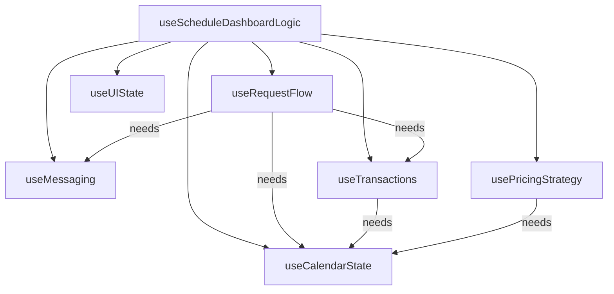

# Specification: ScheduleDashboard Refactoring

## 1. Problem Statement

The `useScheduleDashboardLogic.js` hook has grown to **1654 lines (55KB)**, making it difficult to:
- Navigate and understand
- Test individual domains independently
- Iterate on specific features without risk of regression
- Onboard new developers

**Comparison**: `useGuestLeasesPageLogic.js` is **670 lines (20KB)** and is already approaching the upper limit of readability.

### Quality Metrics (Current State)

| Metric | Current | Target |
|--------|---------|--------|
| Total Lines | 1654 | ~1160 (30% reduction via extraction) |
| Cyclomatic Complexity | High (50+ handlers) | Low (orchestrator delegates) |
| State Variables | 30+ in single hook | 5-8 per domain hook |
| useCallback Count | 35+ | 5-10 per domain hook |
| useMemo Count | 10+ | 2-4 per domain hook |
| Import Count | 3 (React only) | Domain-specific imports |

---

## 2. Proposed Architecture

### 2.1 Domain Decomposition

Split the monolithic hook into **6 domain-specific hooks**:

| Hook | Responsibility | ~Lines | State Vars |
|------|----------------|--------|------------|
| `useCalendarState` | userNights, roommateNights, pendingNights, blockedNights, sharedNights, currentMonth, adjacency detection | 150 | 6 |
| `useRequestFlow` | selectedNight, requestType, isSwapMode, isCounterMode, all request/swap/share handlers | 400 | 10 |
| `useMessaging` | messages, isSending, handleSendMessage | 80 | 2 |
| `useTransactions` | transactions, transactionsByDate, handleAccept/Decline/Cancel | 250 | 3 |
| `usePricingStrategy` | pricingStrategy, priceOverlays, computedExamples, localStorage persistence | 200 | 4 |
| `useUIState` | isBuyOutOpen, isChatOpen, dashboardMode, modals, activeTransactionId | 80 | 6 |

**Main Hook**: `useScheduleDashboardLogic` becomes a **thin orchestrator** (~100 lines) that:
1. Calls each domain hook
2. Passes cross-domain dependencies
3. Returns unified API to component

### 2.2 Directory Structure

```
ScheduleDashboard/
├── index.jsx                      # Main component (unchanged)
├── useScheduleDashboardLogic.js   # Thin orchestrator (~100 lines)
├── hooks/
│   ├── useCalendarState.js
│   ├── useRequestFlow.js
│   ├── useMessaging.js
│   ├── useTransactions.js
│   ├── usePricingStrategy.js
│   └── useUIState.js
├── helpers/
│   ├── dateHelpers.js             # toDateString, toDateStrings, etc.
│   └── priceCalculations.js       # getNoticeThresholdForDate, EDGE_MULTIPLIERS
├── data/
│   └── mockData.js                # MOCK_LEASE, MOCK_MESSAGES, etc.
├── api/
│   └── scheduleDashboardApi.js    # fetchUserNights, createBuyoutRequest, etc.
└── components/
    └── (existing components)
```

### 2.3 Cross-Domain Dependencies



---

## 3. Code Before/After Snippets

### 3.1 Date Helpers Extraction

**BEFORE** (in useScheduleDashboardLogic.js lines 18-41):
```javascript
// ============================================================================
// DATE HELPERS
// ============================================================================

/**
 * Convert Date to YYYY-MM-DD string
 */
function toDateString(date) {
  if (!date) return null;
  if (typeof date === 'string') return date;
  const year = date.getFullYear();
  const month = String(date.getMonth() + 1).padStart(2, '0');
  const day = String(date.getDate()).padStart(2, '0');
  return `${year}-${month}-${day}`;
}

/**
 * Convert array of Dates to array of date strings
 */
function toDateStrings(dates) {
  if (!dates || !Array.isArray(dates)) return [];
  return dates.map(d => toDateString(d));
}
```

**AFTER** (helpers/dateHelpers.js):
```javascript
/**
 * Date manipulation utilities for ScheduleDashboard
 * @module helpers/dateHelpers
 */

/**
 * Convert Date to YYYY-MM-DD string
 * @param {Date|string|null} date - Date to convert
 * @returns {string|null} ISO date string or null
 */
export function toDateString(date) {
  if (!date) return null;
  if (typeof date === 'string') return date;
  const year = date.getFullYear();
  const month = String(date.getMonth() + 1).padStart(2, '0');
  const day = String(date.getDate()).padStart(2, '0');
  return `${year}-${month}-${day}`;
}

/**
 * Convert array of Dates to array of date strings
 * @param {Array<Date|string>} dates - Dates to convert
 * @returns {string[]} Array of ISO date strings
 */
export function toDateStrings(dates) {
  if (!dates || !Array.isArray(dates)) return [];
  return dates.map(d => toDateString(d));
}
```

---

### 3.2 Mock Data Extraction

**BEFORE** (in useScheduleDashboardLogic.js lines 186-328):
```javascript
// ============================================================================
// MOCK DATA
// ============================================================================

const MOCK_LEASE = {
  _id: 'lease-123',
  propertyName: 'Modern 2BR in Williamsburg',
  propertyAddress: '150 Bedford Ave, Brooklyn, NY 11211',
  startDate: '2025-01-01',
  endDate: '2025-06-30',
  nightlyRate: 175
};

const MOCK_ROOMMATE = {
  _id: 'user-456',
  firstName: 'Sarah',
  lastName: 'Chen',
  avatarUrl: null,
  email: 'sarah.c@example.com'
};

// ... 100+ more lines of mock data
```

**AFTER** (data/mockData.js):
```javascript
/**
 * Mock data for ScheduleDashboard development and testing
 * @module data/mockData
 *
 * NOTE: Replace with real API calls when backend is ready.
 * See api/scheduleDashboardApi.js for API stubs.
 */

export const MOCK_LEASE = {
  _id: 'lease-123',
  propertyName: 'Modern 2BR in Williamsburg',
  propertyAddress: '150 Bedford Ave, Brooklyn, NY 11211',
  startDate: '2025-01-01',
  endDate: '2025-06-30',
  nightlyRate: 175
};

export const MOCK_ROOMMATE = {
  _id: 'user-456',
  firstName: 'Sarah',
  lastName: 'Chen',
  avatarUrl: null,
  email: 'sarah.c@example.com'
};

export const MOCK_MESSAGES = [
  {
    id: 'msg-1',
    senderId: 'user-456',
    senderName: 'Sarah',
    text: 'Hey! Would you be interested in swapping Feb 14th? I have Valentine\'s plans.',
    timestamp: new Date(2026, 1, 1, 14, 30),
    type: 'message'
  },
  // ... additional messages
];

export const MOCK_TRANSACTIONS = [
  {
    id: 'txn-1',
    date: new Date(2026, 0, 28),
    type: 'buyout',
    nights: [new Date(2026, 1, 14)],
    amount: 150,
    direction: 'outgoing',
    status: 'pending',
    counterparty: 'Sarah C.'
  },
  // ... additional transactions
];

export const MOCK_FLEXIBILITY_METRICS = {
  user: {
    responseTime: '< 1 hour',
    approvalRate: '98%',
    nightsOffered: 12,
    cancellations: 0
  },
  roommate: {
    responseTime: '2 hours',
    approvalRate: '92%',
    nightsOffered: 5,
    cancellations: 1
  }
};

export const MOCK_USER_FLEXIBILITY_SCORE = 8;
```

---

### 3.3 API Stubs Extraction

**BEFORE** (in useScheduleDashboardLogic.js lines 42-185):
```javascript
// ============================================================================
// DATA FETCHING STUBS (Replace with real API calls)
// ============================================================================

/**
 * Fetch user's nights for this lease
 */
async function fetchUserNights(leaseId, userId) {
  console.log('[API Stub] fetchUserNights:', { leaseId, userId });
  return [
    '2026-02-02', '2026-02-03', '2026-02-04', '2026-02-05',
    // ...
  ];
}

async function fetchRoommateNights(leaseId, roommateId) {
  // ...
}
// ... more stubs
```

**AFTER** (api/scheduleDashboardApi.js):
```javascript
/**
 * API client for ScheduleDashboard
 * @module api/scheduleDashboardApi
 *
 * TODO: Replace stubs with real Supabase/Edge Function calls
 */

import { supabase } from '../../../../lib/supabase.js';

/**
 * Fetch user's nights for this lease
 * @param {string} leaseId - The lease ID
 * @param {string} userId - The current user's ID
 * @returns {Promise<string[]>} Array of date strings (YYYY-MM-DD)
 */
export async function fetchUserNights(leaseId, userId) {
  // TODO: Replace with real API call
  // Query calendar_stays where user_id = userId AND lease_id = leaseId
  console.log('[API Stub] fetchUserNights:', { leaseId, userId });

  // Mock data - February & March 2026 (Mon-Thu user pattern)
  return [
    '2026-02-02', '2026-02-03', '2026-02-04', '2026-02-05',
    '2026-02-09', '2026-02-10', '2026-02-11', '2026-02-12',
    // ...
  ];
}

/**
 * Fetch roommate's nights for this lease
 * @param {string} leaseId - The lease ID
 * @param {string} roommateId - The roommate's user ID
 * @returns {Promise<string[]>} Array of date strings (YYYY-MM-DD)
 */
export async function fetchRoommateNights(leaseId, roommateId) {
  console.log('[API Stub] fetchRoommateNights:', { leaseId, roommateId });
  return [
    '2026-02-06', '2026-02-07', '2026-02-08',
    // ...
  ];
}

/**
 * Fetch pending date change requests for this lease
 */
export async function fetchPendingRequests(leaseId) {
  console.log('[API Stub] fetchPendingRequests:', { leaseId });
  return ['2026-02-14'];
}

/**
 * Fetch blocked/unavailable dates for this lease
 */
export async function fetchBlockedDates(leaseId) {
  console.log('[API Stub] fetchBlockedDates:', { leaseId });
  return [];
}

/**
 * Fetch chat messages for this lease
 */
export async function fetchChatMessages(leaseId) {
  console.log('[API Stub] fetchChatMessages:', { leaseId });
  return [];
}

/**
 * Fetch transaction history for this lease
 */
export async function fetchTransactions(leaseId) {
  console.log('[API Stub] fetchTransactions:', { leaseId });
  return [];
}

/**
 * Send a chat message
 */
export async function sendMessage(leaseId, text) {
  console.log('[API Stub] sendMessage:', { leaseId, text });
}

/**
 * Create a buyout request
 * @param {object} params - Request parameters
 * @returns {Promise<object>} Created request
 */
export async function createBuyoutRequest({ leaseId, nightDate, message, basePrice }) {
  console.log('[API Stub] createBuyoutRequest:', { leaseId, nightDate, message, basePrice });
  await new Promise(resolve => setTimeout(resolve, 1000));

  return {
    id: `request-${Date.now()}`,
    leaseId,
    nightDate,
    message,
    basePrice,
    status: 'pending',
    createdAt: new Date().toISOString()
  };
}
```

---

### 3.4 Pricing Calculations Extraction

**BEFORE** (in useScheduleDashboardLogic.js lines 483-596):
```javascript
// -------------------------------------------------------------------------
// PRICING STRATEGY STATE (User-Centric 3-Tier Model)
// -------------------------------------------------------------------------
const DEFAULT_NOTICE_MULTIPLIERS = {
  flexible: 1.0,
  standard: 1.1,
  inconvenient: 1.5,
  disruptive: 2.0,
  emergency: 3.0
};

// ...

// Helper: Determine notice threshold based on days until date
const getNoticeThresholdForDate = (daysUntil) => {
  if (daysUntil < 2) return 'emergency';
  if (daysUntil < 7) return 'disruptive';
  if (daysUntil < 14) return 'inconvenient';
  if (daysUntil < 30) return 'standard';
  return 'flexible';
};

// Tier 3: Edge multipliers by day of week
const EDGE_MULTIPLIERS = {
  start_cheaper: { 0: 1.0, 1: 0.8, 2: 0.9, 3: 1.0, 4: 1.1, 5: 1.2, 6: 1.0 },
  neutral: { 0: 1.0, 1: 1.0, 2: 1.0, 3: 1.0, 4: 1.0, 5: 1.0, 6: 1.0 },
  end_cheaper: { 0: 1.0, 1: 1.2, 2: 1.1, 3: 1.0, 4: 0.9, 5: 0.8, 6: 1.0 }
};
```

**AFTER** (helpers/priceCalculations.js):
```javascript
/**
 * Pricing calculation utilities for 3-Tier Model
 * @module helpers/priceCalculations
 */

/**
 * Default notice period multipliers
 * Maps notice threshold to price multiplier
 */
export const DEFAULT_NOTICE_MULTIPLIERS = {
  flexible: 1.0,      // 30+ days notice
  standard: 1.1,      // 14-30 days notice
  inconvenient: 1.5,  // 7-14 days notice
  disruptive: 2.0,    // <7 days notice
  emergency: 3.0      // <48 hours notice
};

/**
 * Edge preference multipliers by day of week
 * Key: edgePreference setting
 * Value: Object mapping dayOfWeek (0-6) to multiplier
 */
export const EDGE_MULTIPLIERS = {
  start_cheaper: { 0: 1.0, 1: 0.8, 2: 0.9, 3: 1.0, 4: 1.1, 5: 1.2, 6: 1.0 },
  neutral:       { 0: 1.0, 1: 1.0, 2: 1.0, 3: 1.0, 4: 1.0, 5: 1.0, 6: 1.0 },
  end_cheaper:   { 0: 1.0, 1: 1.2, 2: 1.1, 3: 1.0, 4: 0.9, 5: 0.8, 6: 1.0 }
};

/**
 * Determine notice threshold based on days until date
 * @param {number} daysUntil - Days from today to target date
 * @returns {'emergency'|'disruptive'|'inconvenient'|'standard'|'flexible'}
 */
export function getNoticeThresholdForDate(daysUntil) {
  if (daysUntil < 2) return 'emergency';
  if (daysUntil < 7) return 'disruptive';
  if (daysUntil < 14) return 'inconvenient';
  if (daysUntil < 30) return 'standard';
  return 'flexible';
}

/**
 * Calculate price for a specific date using 3-tier model
 * @param {Date} date - Target date
 * @param {object} pricingStrategy - User's pricing preferences
 * @param {Date} today - Reference date for notice calculation
 * @returns {number} Calculated price
 */
export function calculatePriceForDate(date, pricingStrategy, today = new Date()) {
  today.setHours(0, 0, 0, 0);

  const baseCost = pricingStrategy.baseCostValue;
  const noticeMultipliers = pricingStrategy.noticeMultipliers || DEFAULT_NOTICE_MULTIPLIERS;

  const dayOfWeek = date.getDay();
  const daysDiff = Math.floor((date - today) / (1000 * 60 * 60 * 24));

  // Tier 2: Notice multiplier
  const noticeThreshold = getNoticeThresholdForDate(daysDiff);
  const noticeMultiplier = noticeMultipliers[noticeThreshold] ?? 1.0;

  // Tier 3: Edge multiplier
  const edgeMultiplier = EDGE_MULTIPLIERS[pricingStrategy.edgePreference]?.[dayOfWeek] || 1.0;

  return Math.round(baseCost * noticeMultiplier * edgeMultiplier);
}

/**
 * Determine visual tier for price overlay styling
 * @param {string} noticeThreshold - Notice threshold level
 * @returns {'within'|'near'|'limit'}
 */
export function getTierForNoticeThreshold(noticeThreshold) {
  if (noticeThreshold === 'emergency' || noticeThreshold === 'disruptive') {
    return 'limit'; // High urgency = red
  }
  if (noticeThreshold === 'inconvenient') {
    return 'near'; // Medium urgency = yellow
  }
  return 'within'; // Low urgency = green
}
```

---

### 3.5 Orchestrator Hook (After Refactoring)

**AFTER** (useScheduleDashboardLogic.js - reduced to ~100 lines):
```javascript
/**
 * Schedule Dashboard Logic Hook - Thin Orchestrator
 *
 * Coordinates domain-specific hooks and provides unified API to component.
 * All business logic is delegated to domain hooks.
 */

import { useState, useEffect } from 'react';

// Domain Hooks
import { useCalendarState } from './hooks/useCalendarState.js';
import { useRequestFlow } from './hooks/useRequestFlow.js';
import { useMessaging } from './hooks/useMessaging.js';
import { useTransactions } from './hooks/useTransactions.js';
import { usePricingStrategy } from './hooks/usePricingStrategy.js';
import { useUIState } from './hooks/useUIState.js';

// Data & API
import { MOCK_LEASE, MOCK_ROOMMATE } from './data/mockData.js';
import { fetchUserNights, fetchRoommateNights, fetchPendingRequests, fetchBlockedDates } from './api/scheduleDashboardApi.js';

// Helpers
import { getLeaseIdFromUrl } from './helpers/urlHelpers.js';

export function useScheduleDashboardLogic() {
  // URL Params
  const [leaseId] = useState(() => getLeaseIdFromUrl());

  // Core Data
  const [isLoading, setIsLoading] = useState(true);
  const [error, setError] = useState(null);
  const [lease, setLease] = useState(null);
  const [roommate, setRoommate] = useState(null);

  // Domain Hooks
  const calendar = useCalendarState();
  const requests = useRequestFlow({
    userNights: calendar.userNights,
    roommateNights: calendar.roommateNights,
    pendingNights: calendar.pendingNights,
    roommate,
    onPendingChange: calendar.setPendingNights,
  });
  const messaging = useMessaging({ leaseId, roommate });
  const transactions = useTransactions({
    onCalendarUpdate: calendar.updateOwnership,
    onMessagesUpdate: messaging.addSystemMessage,
  });
  const pricing = usePricingStrategy({ userNights: calendar.userNights });
  const ui = useUIState();

  // Data Fetching
  useEffect(() => {
    async function loadData() {
      try {
        setIsLoading(true);
        setError(null);

        await new Promise(resolve => setTimeout(resolve, 500));

        setLease(MOCK_LEASE);
        setRoommate(MOCK_ROOMMATE);

        const [userNightsData, roommateNightsData, pendingData, blockedData] = await Promise.all([
          fetchUserNights(leaseId, 'current-user'),
          fetchRoommateNights(leaseId, MOCK_ROOMMATE._id),
          fetchPendingRequests(leaseId),
          fetchBlockedDates(leaseId),
        ]);

        calendar.initialize({
          userNights: userNightsData,
          roommateNights: roommateNightsData,
          pendingNights: pendingData,
          blockedNights: blockedData,
        });

      } catch (err) {
        setError(err.message || 'Failed to load schedule data');
      } finally {
        setIsLoading(false);
      }
    }

    if (leaseId) loadData();
    else {
      setError('No lease ID provided');
      setIsLoading(false);
    }
  }, [leaseId]);

  // Return unified API
  return {
    // Loading & Error
    isLoading,
    error,
    isSubmitting: requests.isSubmitting,

    // Core Data
    lease,
    roommate,

    // Calendar
    ...calendar,

    // Request Flow
    ...requests,

    // Messaging
    ...messaging,

    // Transactions
    ...transactions,

    // Pricing
    ...pricing,

    // UI State
    ...ui,

    // Refresh Handler
    handleRefresh: () => window.location.reload(),
  };
}
```

---

## 4. Implementation Plan

### Phase 1: Extract Helpers & Data (Low Risk) - PARALLELIZABLE

| Task | File | Lines Extracted | Dependency |
|------|------|-----------------|------------|
| 1a | `helpers/dateHelpers.js` | ~25 | None |
| 1b | `helpers/priceCalculations.js` | ~100 | None |
| 1c | `data/mockData.js` | ~140 | None |
| 1d | `api/scheduleDashboardApi.js` | ~90 | None |

**All 4 tasks can run in parallel** - no interdependencies.

### Phase 2: Extract UI State Hook (Low Risk)

1. Create `hooks/useUIState.js`
2. Move drawer states, modal states, dashboardMode
3. Update main hook to use `useUIState()`

### Phase 3: Extract Messaging Hook (Medium Risk)

1. Create `hooks/useMessaging.js`
2. Move messages state and `handleSendMessage`
3. Accept `setMessages` callback for cross-domain updates

### Phase 4: Extract Transactions Hook (Medium Risk)

1. Create `hooks/useTransactions.js`
2. Move transactions state, transactionsByDate, handlers
3. Accept callbacks for calendar state updates

### Phase 5: Extract Pricing Hook (Medium Risk)

1. Create `hooks/usePricingStrategy.js`
2. Move pricing state, overlays, computed examples
3. Accept userNights as dependency

### Phase 6: Extract Calendar & Request Hooks (High Risk)

1. Create `hooks/useCalendarState.js`
2. Create `hooks/useRequestFlow.js`
3. These are most intertwined - do together
4. Extensive testing required

---

## 5. Acceptance Criteria

- [ ] No functional regression (all existing features work)
- [ ] Each hook is < 300 lines
- [ ] Main orchestrator is < 150 lines
- [ ] Unit tests can target individual hooks
- [ ] IDE navigation is improved (smaller files)
- [ ] All imports resolve correctly
- [ ] No circular dependencies

---

## 6. Testing Strategy

- Run existing E2E tests after each phase
- Add unit tests for each new hook
- Manual verification of all request flows:
  - [ ] Buyout request creation
  - [ ] Share request creation
  - [ ] Swap request flow
  - [ ] Counter-offer flow
  - [ ] Accept/Decline requests
  - [ ] Cancel requests
  - [ ] Chat messaging
  - [ ] Pricing settings persistence
  - [ ] Calendar navigation

---

## 7. Risk Assessment

| Phase | Risk Level | Mitigation |
|-------|------------|------------|
| Phase 1 | Low | Pure extraction, no logic changes |
| Phase 2 | Low | Isolated UI state, easy to test |
| Phase 3 | Medium | Cross-domain message updates |
| Phase 4 | Medium | Complex accept/decline logic |
| Phase 5 | Medium | localStorage persistence |
| Phase 6 | High | Core business logic, most handlers |

---

## 8. Rollback Plan

Each phase creates new files without modifying the original hook until integration. If issues arise:
1. Delete new files
2. Original hook remains unchanged
3. Debug in isolation before retry

---

**VERSION**: 1.0
**CREATED**: 2026-01-31
**STATUS**: Ready for Execution
