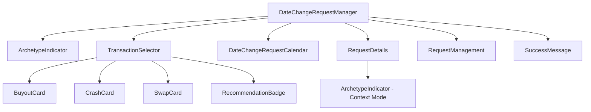

# FRONTEND INTEGRATION PLAN: Pattern 1 - Personalized Defaults

## 1. Overview
This plan outlines the integration of the "Personalized Defaults" pattern into the existing `DateChangeRequestManager` island. The goal is to detect user archetypes and provide intelligent, personalized transaction recommendations.

## 2. Component Dependency Graph

### New Components (from `pattern_1/frontend`):
- **ArchetypeIndicator**: Displays user classification (Big Spender, High Flex, Average).
- **TransactionSelector**: Replaces the basic `RequestTypeSelector` with an intelligence-aware card interface.
- **BuyoutCard/CrashCard/SwapCard**: Specialized cards for each transaction type.
- **RecommendationBadge**: Highlights the "Recommended" choice based on archetype.

## 3. CSS Module Integration Strategy

Existing styles in `app/src/islands/shared/DateChangeRequestManager` use global CSS classes with the `dcr-` prefix. The new components use CSS Modules.

- **Isolation:** New components will retain `.module.css` to prevent style leakage.
- **Theming:** New CSS modules will import variables from `app/src/styles/variables.css` to maintain visual consistency.
- **Migration Path:**
    1.  Copy `TransactionSelector.module.css` and `Cards.module.css` to the component directory.
    2.  Update `DateChangeRequestManager.css` to include styles for the new `ArchetypeIndicator` container.

## 4. State Management Updates

### New State Variables (in `DateChangeRequestManager.jsx`):
- `archetype`: String ('BIG_SPENDER', 'HIGH_FLEX', 'AVERAGE')
- `recommendation`: Object containing `type`, `confidence`, and `reasoning`.
- `isArchetypeLoading`: Boolean for detection status.

### Logic Flow:
1.  **Mount:** Trigger `useArchetypeDetection` hook.
2.  **Detection:** Once archetype is detected, `usePersonalizedDefaults` provides the recommended `requestType` and `suggestedPricePercentage`.
3.  **Auto-Select:** If confidence > 80%, automatically set `setRequestType(recommendedType)` and `setPricePercentage(suggestedPrice)`.
4.  **UI Feedback:** Show `ArchetypeIndicator` to explain the "why" behind the defaults.

## 5. Integration Steps

1.  **Scaffold Directory:** Create `app/src/islands/shared/TransactionSelector/`.
2.  **Port Reference Code:** Copy hooks (`useArchetypeDetection`, `usePersonalizedDefaults`) to `app/src/islands/shared/DateChangeRequestManager/hooks/`.
3.  **Enhance DCRM:**
    - Import new hooks and components.
    - Initialize archetype detection in `useEffect`.
    - Replace `<RequestTypeSelector />` with `<TransactionSelector />`.
4.  **Refactor RequestDetails:**
    - Add `archetype` as a prop to `RequestDetails`.
    - Display a subtle `ArchetypeIndicator` near the price slider to justify the default rate.

## 6. Verification Plan
- **Unit Tests:** Test `archetypeLogic.ts` with various transaction histories.
- **Component Tests:** Verify `TransactionSelector` correctly highlights the recommended card.
- **Integration Test:** Ensure selecting a "Buyout" card correctly updates the `DateChangeRequestCalendar` selection mode.
