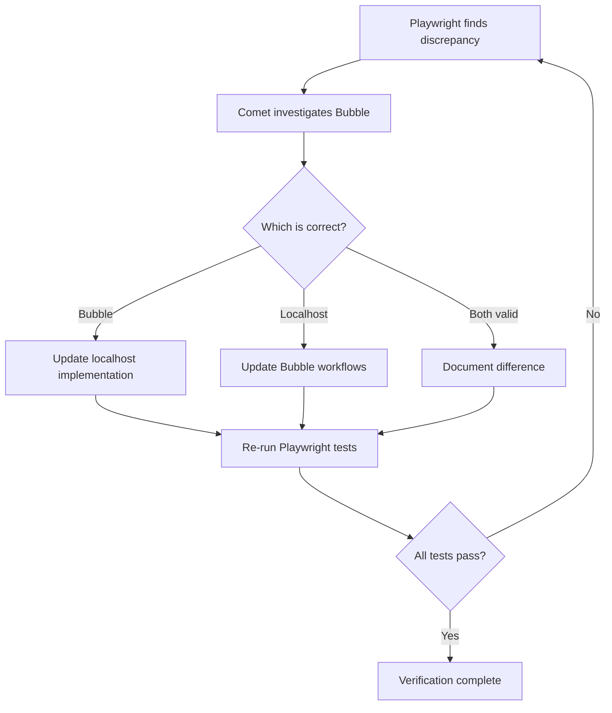

# Verification Phase: Localhost vs Bubble Comparison

**Date:** 2026-01-28  
**Phase:** Post-Implementation Verification  
**Goal:** Compare new localhost implementation against Bubble production (source of truth)

---

## 🎯 Overview

After OpenCode and Claude Code completed the Triple-Check implementation, we need to verify it matches Bubble's actual behavior.

**Three-Step Process:**
1. **Cursor/Claude** → Run Playwright tests comparing localhost vs Bubble
2. **Cursor/Claude** → Generate questions about discrepancies
3. **Comet** → Investigate Bubble IDE and answer questions

---

## 📋 Step-by-Step Execution

### **STEP 1: Cursor Agent - Create Playwright Tests**

**Agent:** Claude Code (in Cursor IDE)  
**Prompt:** `CURSOR_PLAYWRIGHT_COMPARISON_PROMPT.md`  
**Duration:** ~1 hour

**Tasks:**
1. Create `tests/schedule-selector-comparison.spec.ts`
2. Implement comparison testing logic
3. Add screenshot capture
4. Add question generation for Comet

**Command to Run:**
```bash
bun run test tests/schedule-selector-comparison.spec.ts
```

**Deliverables:**
- ✅ Playwright test file created
- ✅ Tests executed successfully
- ✅ Screenshots captured
- ✅ Question files generated in `test-results/comet-questions/`
- ✅ Summary report in `test-results/BUBBLE_COMPARISON_REPORT.md`

---

### **STEP 2: Review Test Results**

**Who:** You (or any team member)  
**What to Check:**

1. **Open:** `test-results/BUBBLE_COMPARISON_REPORT.md`
   - How many discrepancies were found?
   - Which scenarios failed?

2. **Review screenshots:**
   - `test-results/localhost-*.png`
   - `test-results/bubble-*.png`
   - Visual differences?

3. **Check console output:**
   - Did tests complete?
   - Any errors?

**Expected Scenarios:**

| Scenario | Expected Localhost | Expected Bubble | Critical? |
|----------|-------------------|-----------------|-----------|
| Normal 5-Night | 5 nights, valid | 5 nights, valid | 🟡 Medium |
| Wrap-Around | 3 nights, valid | 3 nights, valid | 🟡 Medium |
| **Full Week** | **7 nights, valid** | **? nights, valid** | 🔴 **CRITICAL** |
| Gap Selection | Invalid | Invalid | 🟡 Medium |

**🚨 The Full Week scenario is CRITICAL!**
- Our implementation: 7 days = 7 nights
- Need to confirm: Does Bubble agree?

---

### **STEP 3: Comet Agent - Investigate Bubble**

**Agent:** Comet (Bubble IDE explorer)  
**Prompt:** `COMET_BUBBLE_INVESTIGATION_PROMPT.md`  
**Input:** Question files from `test-results/comet-questions/`

**Process:**

1. **Comet receives questions** (from Step 1 output)

2. **Comet opens Bubble IDE:**
   - URL: `https://bubble.io/`
   - App: Split Lease
   - Page: `z-schedule-test`

3. **Comet investigates:**
   - Finds validation workflows
   - Documents nights calculation formula
   - Checks contiguity logic
   - Compares to Golden Rules

4. **Comet reports findings:**
   - Uses investigation template
   - Provides screenshots
   - Makes recommendations

**Deliverable:** Investigation report answering all questions

---

## 📊 Decision Matrix

After Comet's investigation, you'll need to decide:

### **Scenario A: Bubble Matches Our Implementation** ✅

**Finding:** Bubble calculates 7 days = 7 nights (full week special case)

**Action:**
- ✅ No changes needed
- ✅ Our implementation is correct
- ✅ Mark verification as complete

---

### **Scenario B: Bubble Uses Different Logic** ⚠️

**Finding:** Bubble calculates 7 days = 6 nights (or some other difference)

**Questions to Answer:**
1. Which is correct per business requirements?
2. Is Bubble's behavior intentional or a bug?
3. Should we match Bubble or update Bubble?

**Action Options:**

#### Option 1: Update Our Implementation to Match Bubble
```
Decision: Bubble is the source of truth
Action: Update Golden Validator to match Bubble logic
Impact: Change our formula, update tests
```

#### Option 2: Update Bubble to Match Our Implementation
```
Decision: Our business rule is correct
Action: Update Bubble workflows
Impact: Change Bubble formula, test in version-test
```

#### Option 3: Document as Intentional Difference
```
Decision: Both are valid for different reasons
Action: Document why they differ
Impact: Add notes, possibly show warning in UI
```

---

## 🎯 Critical Questions to Answer

### 1. Full Week Logic

**Question:** Does 7 days = 7 nights or 6 nights?

**Our Implementation:** 7 nights (full week special case)

**Bubble Current:** ??? (Comet will investigate)

**Business Context:**
- User stated: "6-night bookings DO NOT EXIST"
- User stated: "Valid ranges: 2-5 nights OR 7 nights"
- This implies 7 days = 7 nights is correct

**If Bubble shows 6 nights:**
- Bubble is likely WRONG
- Should be updated to match business rule

---

### 2. Contiguity Validation

**Question:** How are wrap-around cases handled?

**Our Implementation:** 
- Sat-Sun-Mon is valid (wrap-around)
- Uses inverse logic for detection

**Bubble Current:** ??? (Comet will investigate)

**If Different:**
- May impact user experience
- Must maintain consistent behavior

---

### 3. Min/Max Nights Enforcement

**Question:** Are host constraints hard or soft?

**Our Implementation:**
- Absolute min/max: Hard (cannot override)
- Host min/max: Soft (warning, then allow)

**Bubble Current:** ??? (Comet will investigate)

**If Different:**
- May reject valid bookings
- May allow invalid bookings

---

## 🔄 Iteration Process

If changes are needed:



---

## 📁 File Structure After Verification

```
Split Lease/
├── tests/
│   └── schedule-selector-comparison.spec.ts        (NEW - Playwright tests)
├── test-results/
│   ├── BUBBLE_COMPARISON_REPORT.md                 (Summary)
│   ├── comet-questions/                            (Questions for Comet)
│   │   ├── normal-5-night-questions.md
│   │   ├── full-week-questions.md
│   │   └── ...
│   ├── bubble-investigation-report.md              (Comet's findings)
│   ├── localhost-*.png                             (Screenshots)
│   └── bubble-*.png
├── docs/schedule/
│   └── VERIFICATION_REPORT.md                      (Final report - to be created)
├── CURSOR_PLAYWRIGHT_COMPARISON_PROMPT.md          (Cursor's instructions)
├── COMET_BUBBLE_INVESTIGATION_PROMPT.md            (Comet's instructions)
└── VERIFICATION_PHASE_COORDINATION.md              (This file)
```

---

## ✅ Success Criteria

**Phase is complete when:**

- [ ] Playwright tests implemented and run successfully
- [ ] All test scenarios executed (at least 4-5 edge cases)
- [ ] Screenshots captured for visual comparison
- [ ] Question files generated for Comet
- [ ] Comet investigated all questions
- [ ] Investigation report completed
- [ ] Decision made on any discrepancies
- [ ] Implementation updated if needed
- [ ] Re-verification tests pass
- [ ] Final verification report written

---

## 🚀 Quick Start Commands

### For Cursor Agent:

```bash
# Step 1: Read your prompt
cat CURSOR_PLAYWRIGHT_COMPARISON_PROMPT.md

# Step 2: Create the test file
# (follow the prompt instructions)

# Step 3: Run the tests
bun run test tests/schedule-selector-comparison.spec.ts

# Step 4: Review results
cat test-results/BUBBLE_COMPARISON_REPORT.md
```

### For Comet Agent:

```bash
# Step 1: Read your prompt
cat COMET_BUBBLE_INVESTIGATION_PROMPT.md

# Step 2: Read the questions
ls test-results/comet-questions/

# Step 3: Investigate Bubble IDE
# (manual process - use Bubble web interface)

# Step 4: Write report
# (follow the investigation template)
```

---

## 📊 Timeline Estimate

| Phase | Agent | Duration | Status |
|-------|-------|----------|--------|
| OpenCode Implementation | OpenCode | 1.5 hours | ✅ Complete |
| Claude Code Implementation | Claude Code | 2.25 hours | ✅ Complete |
| **Playwright Testing** | **Cursor/Claude** | **1 hour** | ⏳ **Next** |
| **Bubble Investigation** | **Comet** | **1-2 hours** | ⏳ **Pending** |
| Decision & Updates | Team | 30 min | ⏳ Pending |
| Re-verification | Cursor | 15 min | ⏳ Pending |
| **Total** | | **~6 hours** | |

---

## 🎉 Final Deliverable

**Document:** `docs/schedule/VERIFICATION_REPORT.md`

**Contents:**
- Summary of testing approach
- Comparison results (localhost vs Bubble)
- Investigation findings
- Discrepancies found
- Decisions made
- Final business rules documentation
- Verification status: ✅ PASS / ⚠️ DIFFERENCES DOCUMENTED

**Similar to:** `docs/pricing/VERIFICATION_REPORT.md` (the pricing project's final report)

---

**Ready to begin verification phase!** 🚀

Start with: Give `CURSOR_PLAYWRIGHT_COMPARISON_PROMPT.md` to Cursor/Claude Code agent.
