# VISUAL VALIDATION REPORT - 12 Admin Pages

**Generated**: 2026-01-26
**Status**: Template - Ready for automated capture
**Purpose**: Compare Bubble prototype vs local development implementation

---

## Executive Summary

This report provides a structured framework for validating 12 admin pages against the Bubble prototype. The validation process captures full-page screenshots of both versions and compares key visual elements.

**Target**: 95%+ visual match per page
**Validation Method**: Automated screenshot capture + manual review

---

## Pages Under Validation

| # | Page Name | Local URL | Bubble URL | Status |
|---|-----------|-----------|-----------|--------|
| 1 | Verify Users | `/_internal/verify-users` | `/version-test/_verify-users` | Pending |
| 2 | Proposal Management | `/_internal/proposal-manage` | `/version-test/_proposal-manage` | Pending |
| 3 | Virtual Meetings | `/_internal/manage-virtual-meetings` | `/version-test/_manage-virtual-meetings` | Pending |
| 4 | Message Curation | `/_internal/message-curation` | `/version-test/_message-curation` | Pending |
| 5 | Co-Host Requests | `/_internal/co-host-requests` | `/version-test/_co-host-requests` | Pending |
| 6 | Internal Emergency | `/_internal/emergency` | `/version-test/_internal-emergency` | Pending |
| 7 | Leases Overview | `/_internal/leases-overview` | `/version-test/_leases-overview` | Pending |
| 8 | Admin Threads | `/_internal/admin-threads` | `/version-test/_quick-threads-manage` | Pending |
| 9 | Modify Listings | `/_internal/modify-listings` | `/version-test/_modify-listings` | Pending |
| 10 | Rental Applications | `/_internal/manage-rental-applications` | `/version-test/_rental-app-manage` | Pending |
| 11 | Quick Price | `/_internal/quick-price` | `/version-test/_quick-price` | Pending |
| 12 | Magic Login Links | `/_internal/send-magic-login-links` | `/version-test/_send-magic-login-links` | Pending |

---

## Validation Scoring

Use this table to track overall match percentage for each page:

| # | Page | Layout | Colors | Typography | Spacing | Components | Overall Match % | Status |
|---|------|--------|--------|------------|---------|------------|-----------------|--------|
| 1 | Verify Users | _ | _ | _ | _ | _ | _% | |
| 2 | Proposal Management | _ | _ | _ | _ | _ | _% | |
| 3 | Virtual Meetings | _ | _ | _ | _ | _ | _% | |
| 4 | Message Curation | _ | _ | _ | _ | _ | _% | |
| 5 | Co-Host Requests | _ | _ | _ | _ | _ | _% | |
| 6 | Internal Emergency | _ | _ | _ | _ | _ | _% | |
| 7 | Leases Overview | _ | _ | _ | _ | _ | _% | |
| 8 | Admin Threads | _ | _ | _ | _ | _ | _% | |
| 9 | Modify Listings | _ | _ | _ | _ | _ | _% | |
| 10 | Rental Applications | _ | _ | _ | _ | _ | _% | |
| 11 | Quick Price | _ | _ | _ | _ | _ | _% | |
| 12 | Magic Login Links | _ | _ | _ | _ | _ | _% | |

**Scoring Scale**: 1-5 (1 = No match, 5 = Perfect match)
**Target**: 95%+ overall match per page

---

## Page-by-Page Validation Details

### 1. Verify Users

**URLs**:
- Local: http://localhost:8001/_internal/verify-users
- Bubble: https://app.split.lease/version-test/_verify-users

**Critical Elements**:
- [ ] AdminHeader present and styled correctly
- [ ] User search dropdown with debounced search
- [ ] 2x2 image grid (profile, selfie, ID front, ID back)
- [ ] Image modal overlays on click
- [ ] Verification toggle button
- [ ] Profile completeness +/- 15% adjustment buttons

**Visual Checklist**:

| Element | Local | Bubble | Match | Notes |
|---------|-------|--------|-------|-------|
| Header styling | [ ] | [ ] | [ ] | |
| Search input | [ ] | [ ] | [ ] | |
| Dropdown results | [ ] | [ ] | [ ] | |
| Image grid layout | [ ] | [ ] | [ ] | |
| Image sizing | [ ] | [ ] | [ ] | |
| Modal styling | [ ] | [ ] | [ ] | |
| Button styling | [ ] | [ ] | [ ] | |
| Colors | [ ] | [ ] | [ ] | |
| Spacing/Padding | [ ] | [ ] | [ ] | |

**Issues Found**:

**Match Score**: __%

**Screenshots**:
- Local: 
- Bubble: 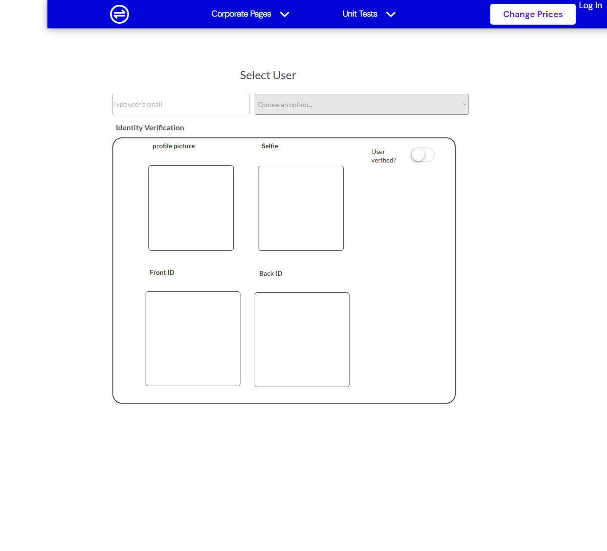

---

### 2. Proposal Management

**URLs**:
- Local: http://localhost:8001/_internal/proposal-manage
- Bubble: https://app.split.lease/version-test/_proposal-manage

**Critical Elements**:
- [ ] Filter section (status, date, listing)
- [ ] Proposal card layout and styling
- [ ] Status indicators and badges
- [ ] Quick creation button
- [ ] Pagination controls (if present)
- [ ] Sort/filter options

**Visual Checklist**:

| Element | Local | Bubble | Match | Notes |
|---------|-------|--------|-------|-------|
| Filter bar | [ ] | [ ] | [ ] | |
| Proposal cards | [ ] | [ ] | [ ] | |
| Status badges | [ ] | [ ] | [ ] | |
| Card spacing | [ ] | [ ] | [ ] | |
| Button styling | [ ] | [ ] | [ ] | |
| Colors | [ ] | [ ] | [ ] | |
| Typography | [ ] | [ ] | [ ] | |
| Pagination | [ ] | [ ] | [ ] | |
| Responsive layout | [ ] | [ ] | [ ] | |

**Issues Found**:

**Match Score**: __%

**Screenshots**:
- Local: 
- Bubble: 

---

### 3. Virtual Meetings

**URLs**:
- Local: http://localhost:8001/_internal/manage-virtual-meetings
- Bubble: https://app.split.lease/version-test/_manage-virtual-meetings

**Critical Elements**:
- [ ] Meeting list/table layout
- [ ] Status indicators
- [ ] Scheduling form/modal
- [ ] Time zone handling
- [ ] Action buttons (schedule, cancel, edit)

**Visual Checklist**:

| Element | Local | Bubble | Match | Notes |
|---------|-------|--------|-------|-------|
| Table/list layout | [ ] | [ ] | [ ] | |
| Column headers | [ ] | [ ] | [ ] | |
| Status badges | [ ] | [ ] | [ ] | |
| Action buttons | [ ] | [ ] | [ ] | |
| Modal styling | [ ] | [ ] | [ ] | |
| Form fields | [ ] | [ ] | [ ] | |
| Colors | [ ] | [ ] | [ ] | |
| Typography | [ ] | [ ] | [ ] | |
| Spacing | [ ] | [ ] | [ ] | |

**Issues Found**:

**Match Score**: __%

**Screenshots**:
- Local: 
- Bubble: 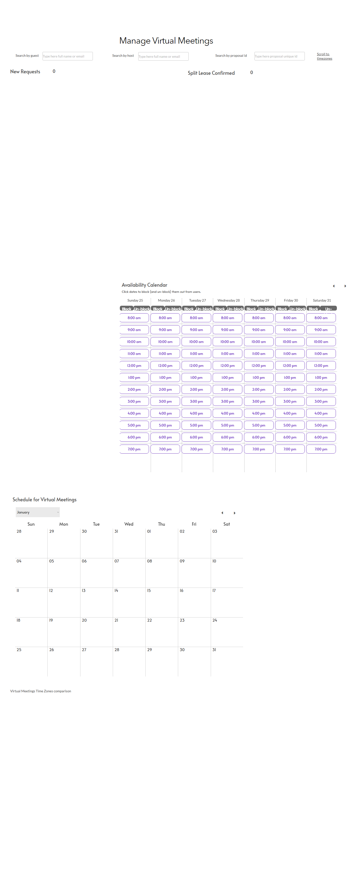

---

### 4. Message Curation

**URLs**:
- Local: http://localhost:8001/_internal/message-curation
- Bubble: https://app.split.lease/version-test/_message-curation

**Critical Elements**:
- [ ] Message list layout
- [ ] Filter options
- [ ] Approval/rejection buttons
- [ ] Message preview styling
- [ ] User info display

**Visual Checklist**:

| Element | Local | Bubble | Match | Notes |
|---------|-------|--------|-------|-------|
| Message list | [ ] | [ ] | [ ] | |
| Filter section | [ ] | [ ] | [ ] | |
| Message cards | [ ] | [ ] | [ ] | |
| User avatars | [ ] | [ ] | [ ] | |
| Text styling | [ ] | [ ] | [ ] | |
| Action buttons | [ ] | [ ] | [ ] | |
| Timestamps | [ ] | [ ] | [ ] | |
| Colors | [ ] | [ ] | [ ] | |
| Spacing | [ ] | [ ] | [ ] | |

**Issues Found**:

**Match Score**: __%

**Screenshots**:
- Local: 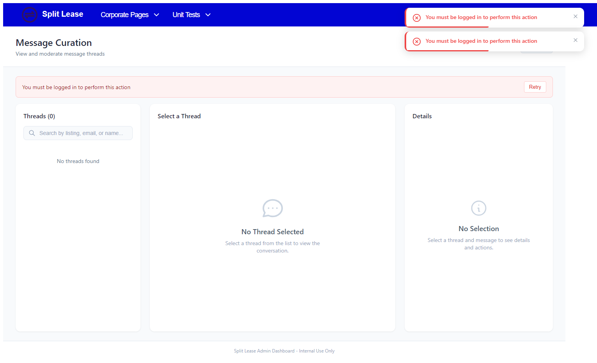
- Bubble: 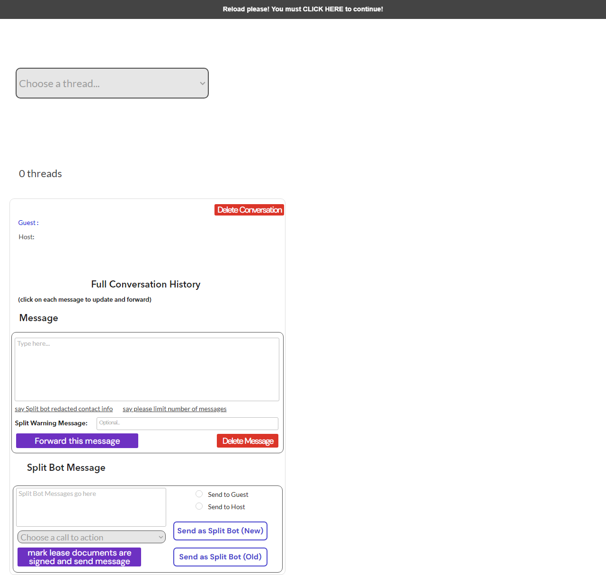

---

### 5. Co-Host Requests

**URLs**:
- Local: http://localhost:8001/_internal/co-host-requests
- Bubble: https://app.split.lease/version-test/_co-host-requests

**Critical Elements**:
- [ ] Request card design
- [ ] Assignment modal/form
- [ ] Status indicators
- [ ] User info display
- [ ] Action buttons

**Visual Checklist**:

| Element | Local | Bubble | Match | Notes |
|---------|-------|--------|-------|-------|
| Request cards | [ ] | [ ] | [ ] | |
| Card layout | [ ] | [ ] | [ ] | |
| User info | [ ] | [ ] | [ ] | |
| Status badges | [ ] | [ ] | [ ] | |
| Modal styling | [ ] | [ ] | [ ] | |
| Form fields | [ ] | [ ] | [ ] | |
| Buttons | [ ] | [ ] | [ ] | |
| Colors | [ ] | [ ] | [ ] | |
| Spacing | [ ] | [ ] | [ ] | |

**Issues Found**:

**Match Score**: __%

**Screenshots**:
- Local: 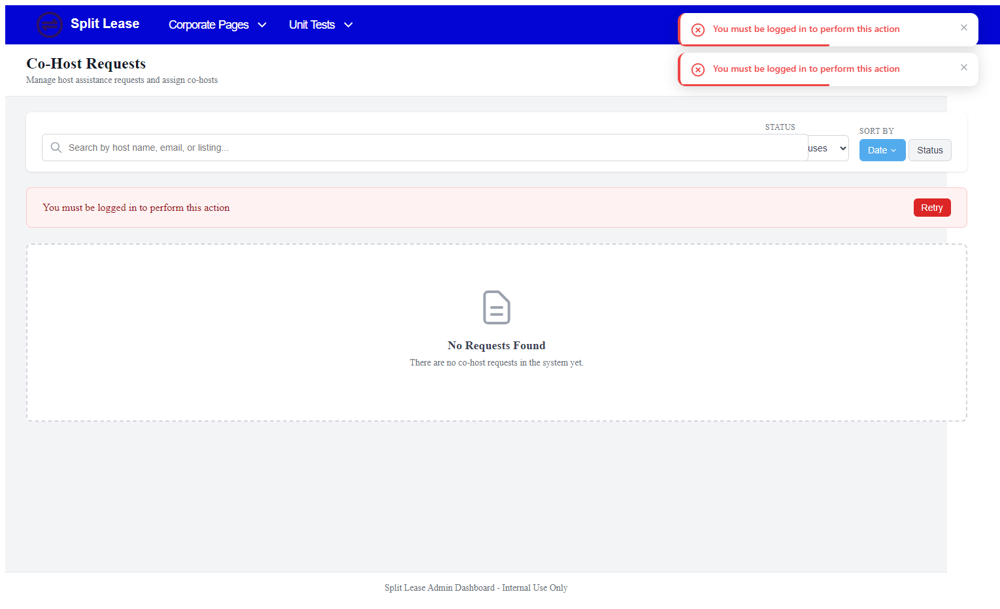
- Bubble: 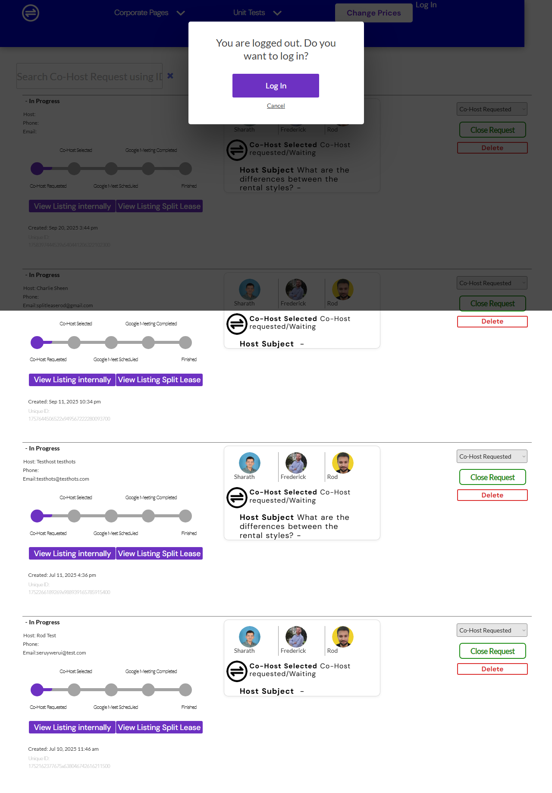

---

### 6. Internal Emergency

**URLs**:
- Local: http://localhost:8001/_internal/emergency
- Bubble: https://app.split.lease/version-test/_internal-emergency

**Critical Elements**:
- [ ] Emergency list layout
- [ ] Status filtering
- [ ] Priority indicators
- [ ] Detail view/modal
- [ ] Action buttons

**Visual Checklist**:

| Element | Local | Bubble | Match | Notes |
|---------|-------|--------|-------|-------|
| List layout | [ ] | [ ] | [ ] | |
| Priority badges | [ ] | [ ] | [ ] | |
| Status indicators | [ ] | [ ] | [ ] | |
| Filter controls | [ ] | [ ] | [ ] | |
| Card styling | [ ] | [ ] | [ ] | |
| Modal design | [ ] | [ ] | [ ] | |
| Colors | [ ] | [ ] | [ ] | |
| Typography | [ ] | [ ] | [ ] | |
| Spacing | [ ] | [ ] | [ ] | |

**Issues Found**:

**Match Score**: __%

**Screenshots**:
- Local: 
- Bubble: 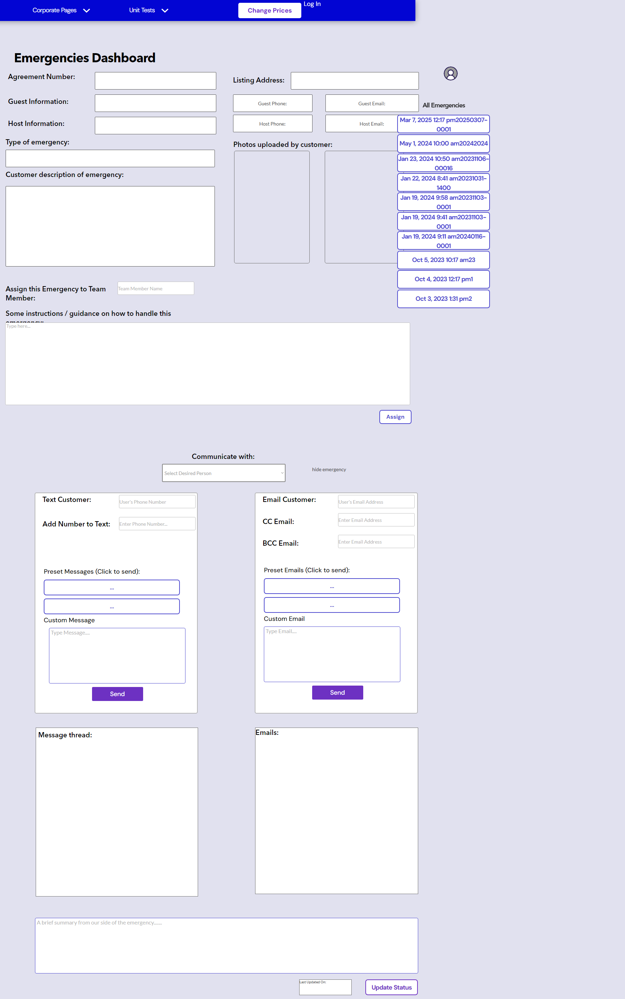

---

### 7. Leases Overview

**URLs**:
- Local: http://localhost:8001/_internal/leases-overview
- Bubble: https://app.split.lease/version-test/_leases-overview

**Critical Elements**:
- [ ] Lease list/table structure
- [ ] Filter controls
- [ ] Status badges
- [ ] Sort options
- [ ] Detail information

**Visual Checklist**:

| Element | Local | Bubble | Match | Notes |
|---------|-------|--------|-------|-------|
| Table layout | [ ] | [ ] | [ ] | |
| Column headers | [ ] | [ ] | [ ] | |
| Row styling | [ ] | [ ] | [ ] | |
| Status badges | [ ] | [ ] | [ ] | |
| Filter bar | [ ] | [ ] | [ ] | |
| Sort controls | [ ] | [ ] | [ ] | |
| Colors | [ ] | [ ] | [ ] | |
| Typography | [ ] | [ ] | [ ] | |
| Spacing | [ ] | [ ] | [ ] | |

**Issues Found**:

**Match Score**: __%

**Screenshots**:
- Local: 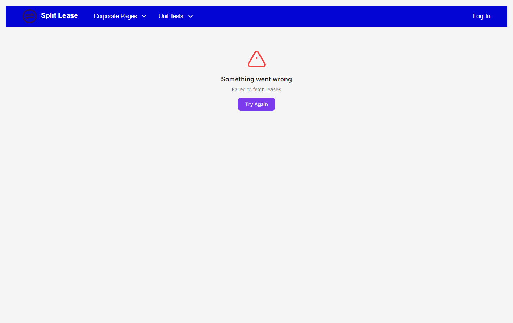
- Bubble: 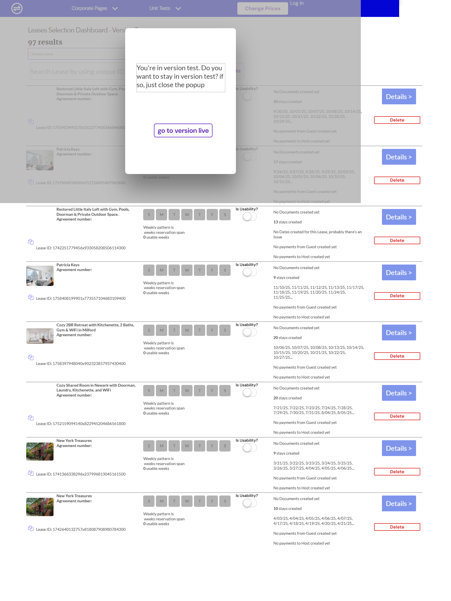

---

### 8. Admin Threads

**URLs**:
- Local: http://localhost:8001/_internal/admin-threads
- Bubble: https://app.split.lease/version-test/_quick-threads-manage

**Critical Elements**:
- [ ] Thread list layout
- [ ] Message preview styling
- [ ] Search/filter controls
- [ ] Read/unread indicators
- [ ] Action buttons

**Visual Checklist**:

| Element | Local | Bubble | Match | Notes |
|---------|-------|--------|-------|-------|
| Thread list | [ ] | [ ] | [ ] | |
| Thread cards | [ ] | [ ] | [ ] | |
| Message preview | [ ] | [ ] | [ ] | |
| User info | [ ] | [ ] | [ ] | |
| Timestamps | [ ] | [ ] | [ ] | |
| Status indicators | [ ] | [ ] | [ ] | |
| Search bar | [ ] | [ ] | [ ] | |
| Colors | [ ] | [ ] | [ ] | |
| Spacing | [ ] | [ ] | [ ] | |

**Issues Found**:

**Match Score**: __%

**Screenshots**:
- Local: 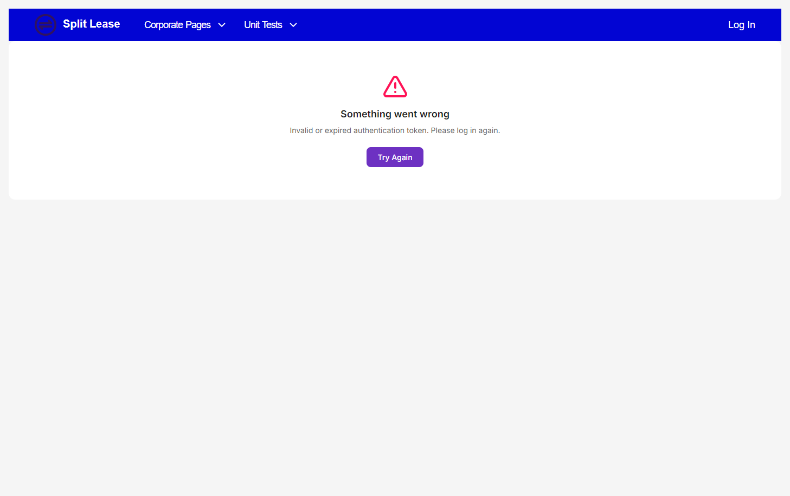
- Bubble: 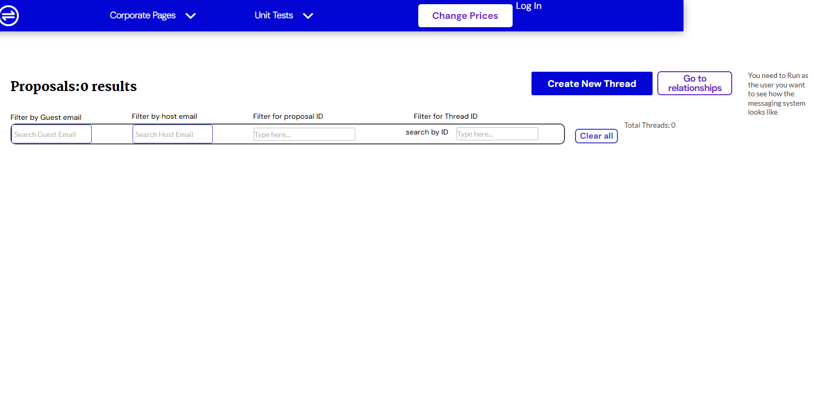

---

### 9. Modify Listings

**URLs**:
- Local: http://localhost:8001/_internal/modify-listings
- Bubble: https://app.split.lease/version-test/_modify-listings

**Critical Elements**:
- [ ] Tab navigation design
- [ ] Form field styling
- [ ] Photo upload interface
- [ ] Validation/error messages
- [ ] Save buttons placement

**Visual Checklist**:

| Element | Local | Bubble | Match | Notes |
|---------|-------|--------|-------|-------|
| Tab navigation | [ ] | [ ] | [ ] | |
| Tab styling | [ ] | [ ] | [ ] | |
| Form fields | [ ] | [ ] | [ ] | |
| Input styling | [ ] | [ ] | [ ] | |
| Photo upload | [ ] | [ ] | [ ] | |
| Buttons | [ ] | [ ] | [ ] | |
| Error messages | [ ] | [ ] | [ ] | |
| Colors | [ ] | [ ] | [ ] | |
| Spacing | [ ] | [ ] | [ ] | |

**Issues Found**:

**Match Score**: __%

**Screenshots**:
- Local: 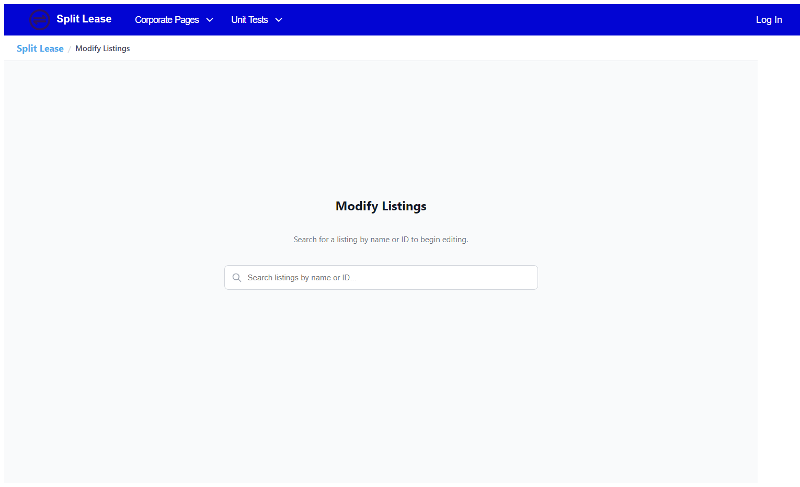
- Bubble: 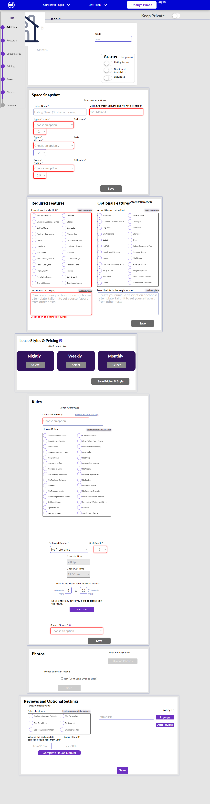

---

### 10. Rental Applications

**URLs**:
- Local: http://localhost:8001/_internal/manage-rental-applications
- Bubble: https://app.split.lease/version-test/_rental-app-manage

**Critical Elements**:
- [ ] Application list layout
- [ ] Status indicators
- [ ] Review workflow UI
- [ ] Filter controls
- [ ] Action buttons

**Visual Checklist**:

| Element | Local | Bubble | Match | Notes |
|---------|-------|--------|-------|-------|
| List layout | [ ] | [ ] | [ ] | |
| Application cards | [ ] | [ ] | [ ] | |
| Status badges | [ ] | [ ] | [ ] | |
| Filter bar | [ ] | [ ] | [ ] | |
| Action buttons | [ ] | [ ] | [ ] | |
| User info | [ ] | [ ] | [ ] | |
| Modal design | [ ] | [ ] | [ ] | |
| Colors | [ ] | [ ] | [ ] | |
| Spacing | [ ] | [ ] | [ ] | |

**Issues Found**:

**Match Score**: __%

**Screenshots**:
- Local: 
- Bubble: 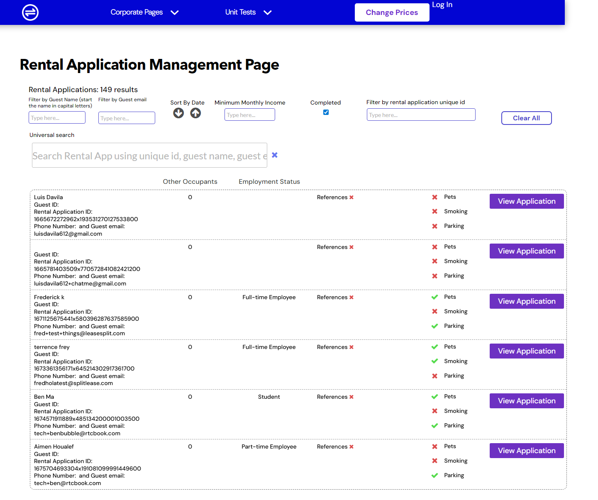

---

### 11. Quick Price

**URLs**:
- Local: http://localhost:8001/_internal/quick-price
- Bubble: https://app.split.lease/version-test/_quick-price

**Critical Elements**:
- [ ] Pricing controls layout
- [ ] Global multiplier UI
- [ ] Listing activation toggle
- [ ] Filter options
- [ ] Save button placement

**Visual Checklist**:

| Element | Local | Bubble | Match | Notes |
|---------|-------|--------|-------|-------|
| Listing list | [ ] | [ ] | [ ] | |
| Price inputs | [ ] | [ ] | [ ] | |
| Multiplier controls | [ ] | [ ] | [ ] | |
| Toggle switches | [ ] | [ ] | [ ] | |
| Filter bar | [ ] | [ ] | [ ] | |
| Buttons | [ ] | [ ] | [ ] | |
| Table/card layout | [ ] | [ ] | [ ] | |
| Colors | [ ] | [ ] | [ ] | |
| Spacing | [ ] | [ ] | [ ] | |

**Issues Found**:

**Match Score**: __%

**Screenshots**:
- Local: 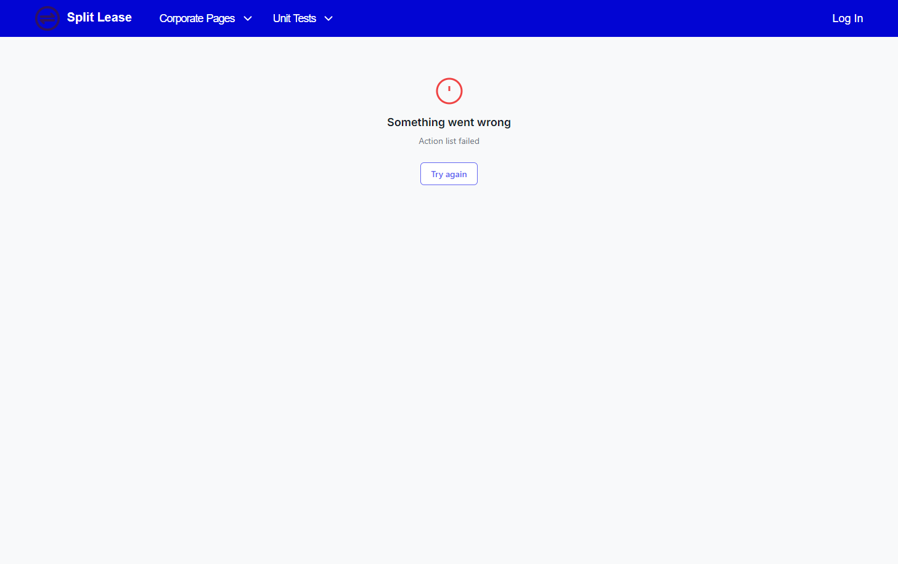
- Bubble: 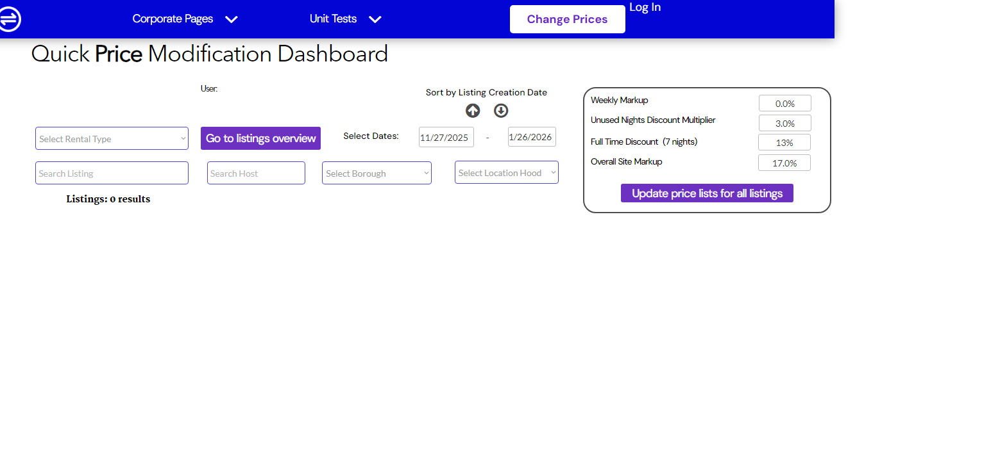

---

### 12. Magic Login Links

**URLs**:
- Local: http://localhost:8001/_internal/send-magic-login-links
- Bubble: https://app.split.lease/version-test/_send-magic-login-links

**Critical Elements**:
- [ ] Multi-step form flow (4 steps)
- [ ] Step indicator/progress bar
- [ ] User search interface
- [ ] Destination selection
- [ ] Navigation buttons

**Visual Checklist**:

| Element | Local | Bubble | Match | Notes |
|---------|-------|--------|-------|-------|
| Step indicator | [ ] | [ ] | [ ] | |
| Form layout | [ ] | [ ] | [ ] | |
| Search input | [ ] | [ ] | [ ] | |
| Dropdown styling | [ ] | [ ] | [ ] | |
| Form fields | [ ] | [ ] | [ ] | |
| Buttons | [ ] | [ ] | [ ] | |
| Progress bar | [ ] | [ ] | [ ] | |
| Colors | [ ] | [ ] | [ ] | |
| Spacing | [ ] | [ ] | [ ] | |

**Issues Found**:

**Match Score**: __%

**Screenshots**:
- Local: 
- Bubble: 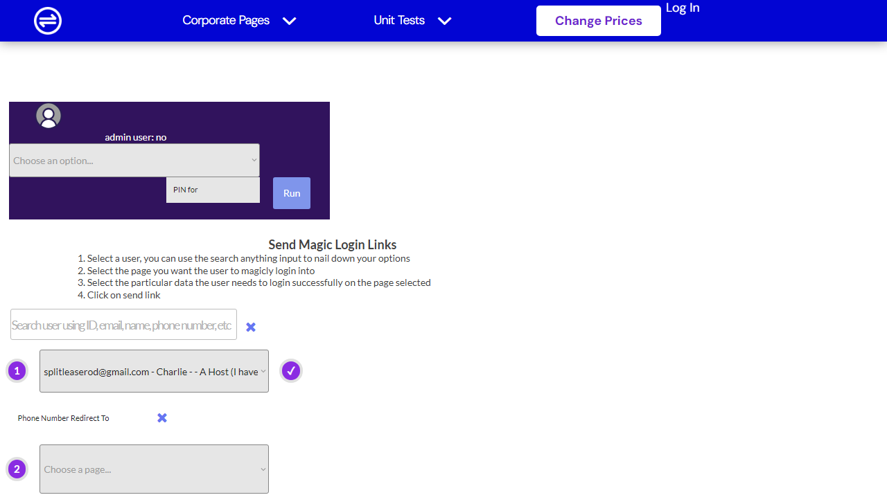

---

## Automated Validation Guide

### Prerequisites

1. Local dev server running on `http://localhost:8001`
2. Network access to Bubble prototype
3. Node.js with Playwright installed

### Running the Automated Capture

```bash
# From project root
node scripts/visual-validation.js
```

This script will:
1. Navigate to each page pair
2. Capture full-page screenshots
3. Save to `docs/Done/visual-validation-screenshots/`
4. Generate this report template with results

### Screenshot Directory Structure

```
docs/Done/visual-validation-screenshots/
├── 01-verify-users-local.png
├── 01-verify-users-bubble.png
├── 02-proposal-management-local.png
├── 02-proposal-management-bubble.png
├── ... (24 total screenshots)
└── 12-magic-login-links-bubble.png
```

---

## Manual Review Workflow

### Step 1: Review Screenshots

For each page:
1. Open the local screenshot
2. Open the Bubble screenshot side-by-side
3. Compare visual elements systematically

### Step 2: Score Visual Elements

Rate each element on the 5-point scale:
- **5**: Perfect match
- **4**: Minor differences, not noticeable
- **3**: Some differences, slightly noticeable
- **2**: Significant differences
- **1**: Major discrepancies

### Step 3: Document Issues

For each issue found:
- Describe the specific element
- Explain the difference
- Assign priority: High/Medium/Low
- Suggest fix if applicable

### Step 4: Calculate Overall Match

Formula:
```
Overall Match % = (Sum of all element scores / Total possible score) × 100
```

Example: (42 / 45) × 100 = 93.3%

### Step 5: Determine Status

- **95%+ Match**: APPROVED - Move to functional testing
- **90-94% Match**: REVIEW NEEDED - Document fixes and remediate
- **<90% Match**: ESCALATE - Significant rework required

---

## Sign-Off

| Role | Name | Date | Status |
|------|------|------|--------|
| Visual Designer | __________ | __________ | [ ] Approved |
| Developer | __________ | __________ | [ ] Approved |
| QA Lead | __________ | __________ | [ ] Approved |

---

## Findings Summary

**Total Pages Validated**: 12
**Pages Meeting 95%+ Target**: __ / 12
**Pages Requiring Fixes**: __ / 12
**Critical Issues Found**: __

### High Priority Issues

(To be filled after manual review)

### Medium Priority Issues

(To be filled after manual review)

### Low Priority Issues

(To be filled after manual review)

---

**Report Status**: Template - Awaiting automated screenshot capture
**Last Updated**: 2026-01-26
