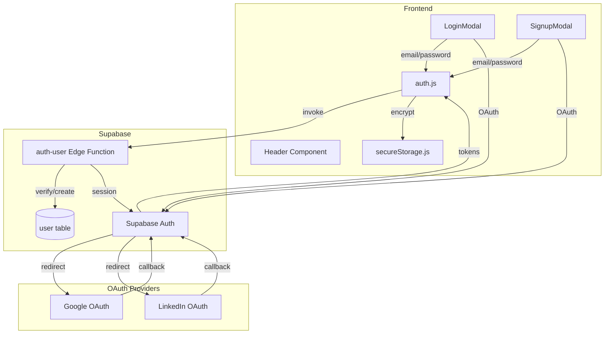
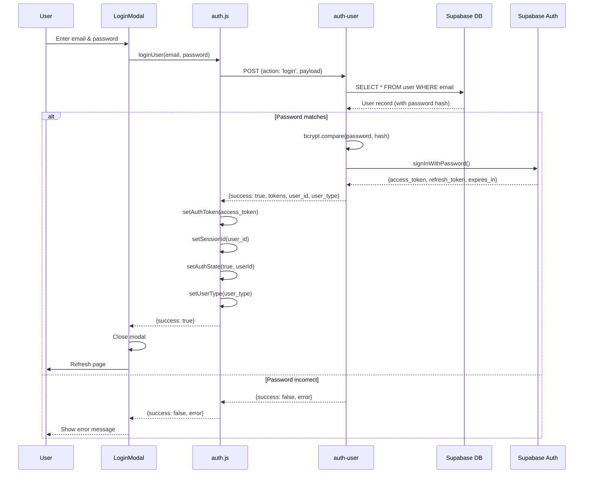
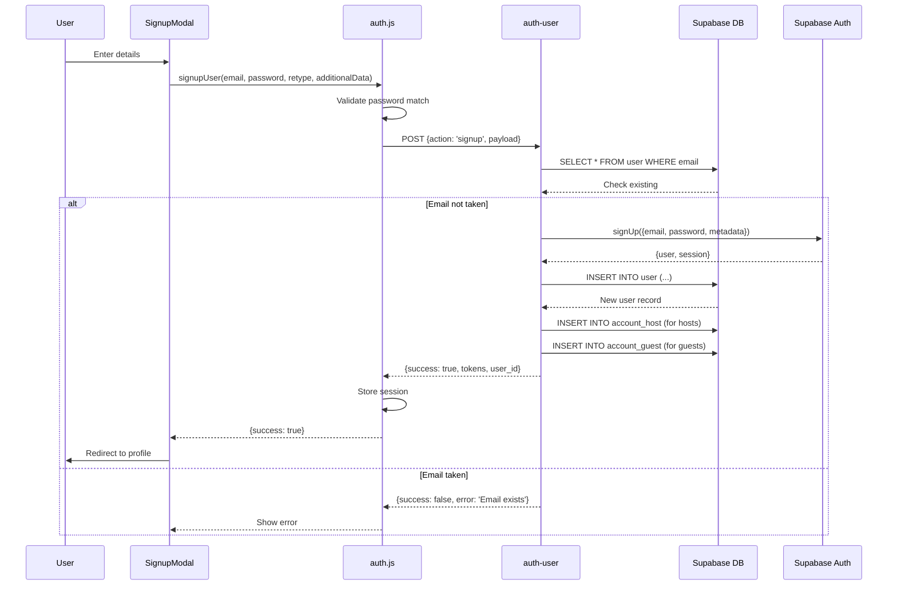
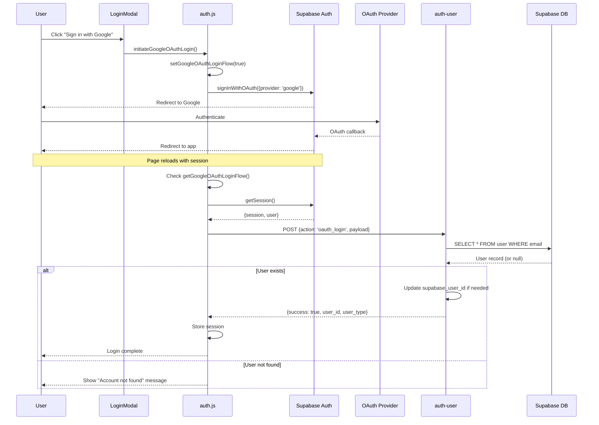
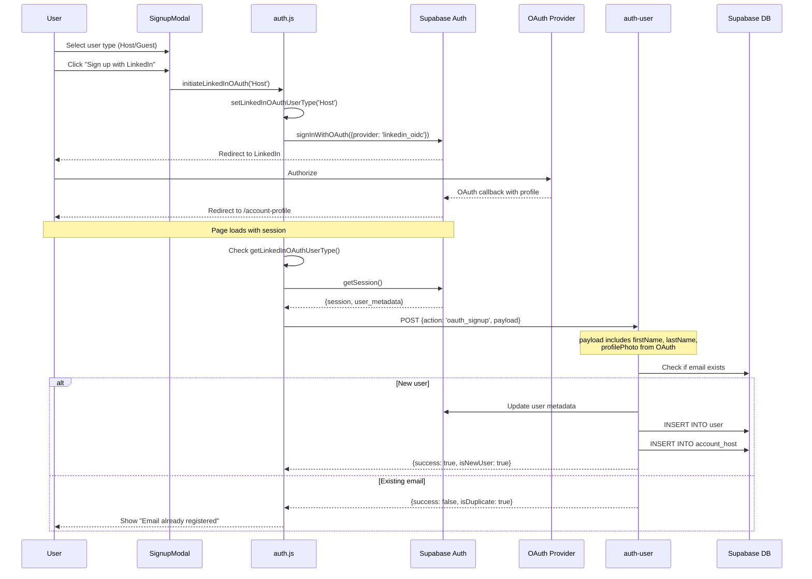
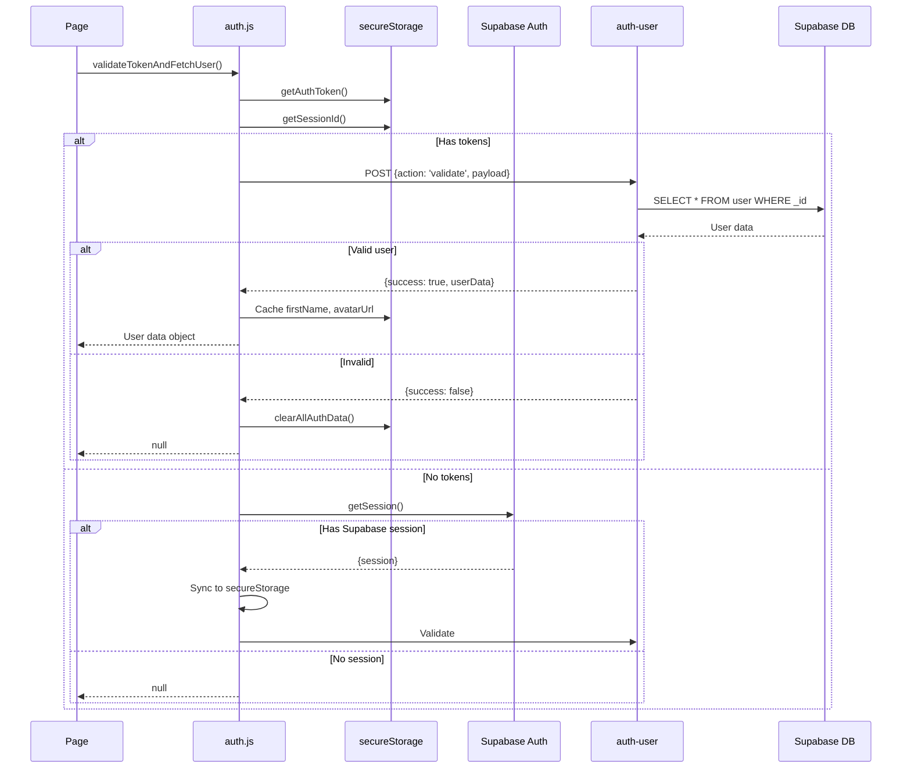
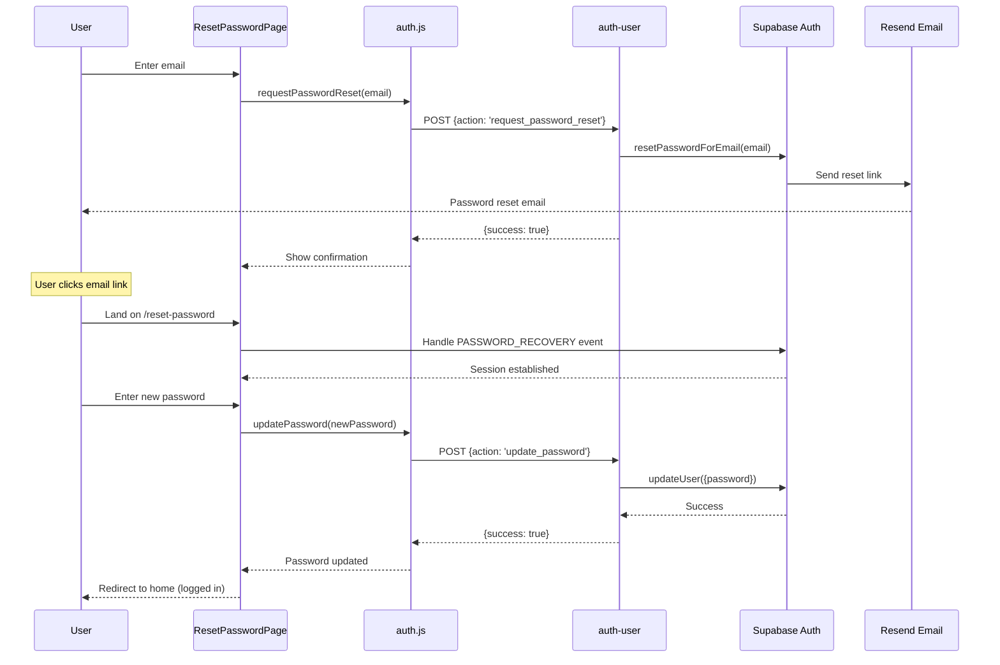
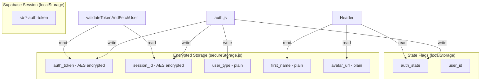
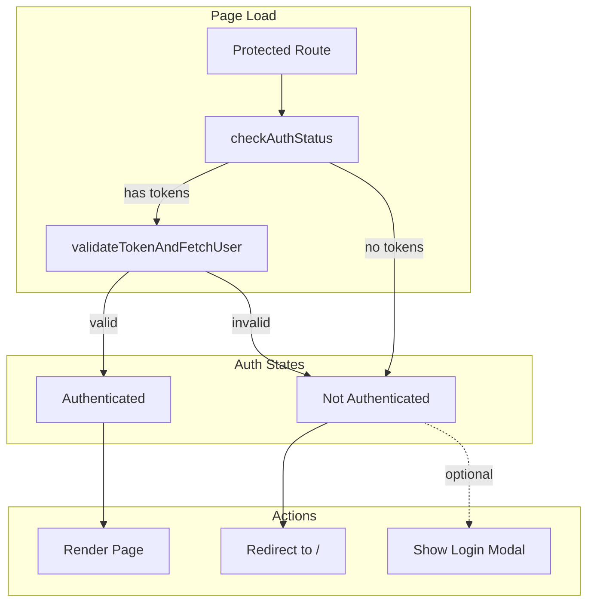

# Authentication Flow Architecture

This document describes the authentication system in Split Lease.

## Authentication Methods

Split Lease supports multiple authentication methods:

1. **Email/Password** - Traditional credential-based login
2. **Google OAuth** - Sign in with Google
3. **LinkedIn OAuth** - Sign in with LinkedIn
4. **Magic Link** - Passwordless email login

## Authentication Architecture

## Email/Password Login Flow

## Email/Password Signup Flow

## OAuth Login Flow (Google/LinkedIn)

## OAuth Signup Flow

## Token Validation Flow

## Password Reset Flow

## Session Storage Architecture

## Protected Route Pattern

## Security Considerations

1. **Token Storage**: Auth tokens are AES-encrypted in localStorage
2. **JWT Validation**: Edge Functions verify JWTs on protected endpoints
3. **CORS**: Strict CORS headers on all Edge Functions
4. **Password Hashing**: bcrypt for password storage
5. **Session Expiry**: Tokens expire and require refresh
6. **OAuth State**: OAuth flow state stored in localStorage during redirect
7. **Secure Cookies**: Production uses secure cookies for session persistence

## Key Files

| File | Purpose |
|------|---------|
| `app/src/lib/auth.js` | Core auth functions |
| `app/src/lib/secureStorage.js` | Encrypted storage |
| `app/src/lib/supabase.js` | Supabase client setup |
| `supabase/functions/auth-user/` | Auth Edge Function |
