# Component Hierarchy

This document describes the React component architecture in Split Lease.

## Islands Architecture Overview

Split Lease uses an "Islands Architecture" where each page is an independent React application:

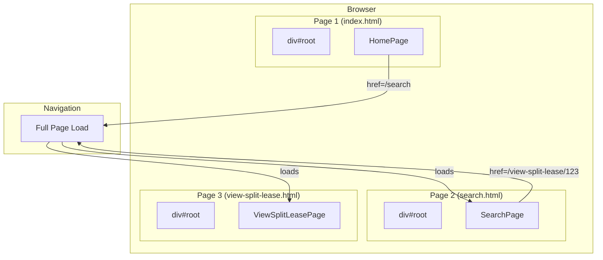

## Page Component Structure

Each page follows the "Hollow Component" pattern:

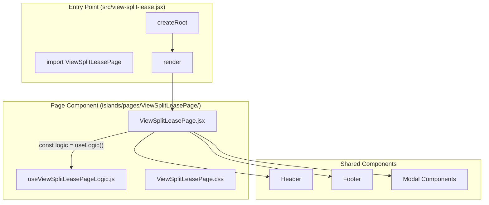

## Component Categories

### 1. Page Components (`islands/pages/`)

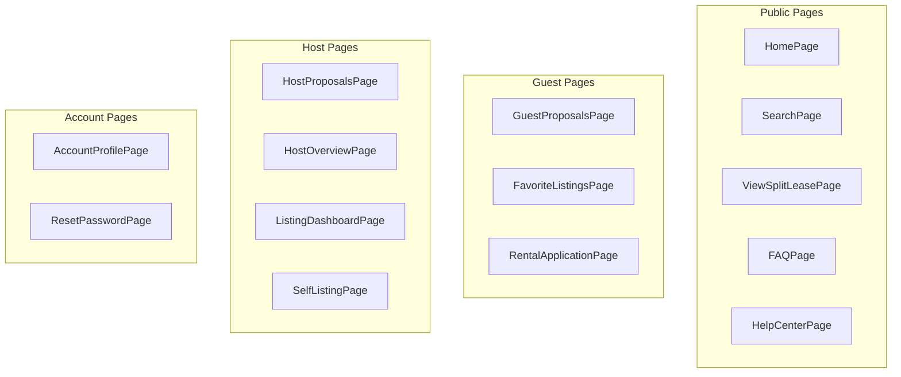

### 2. Shared Components (`islands/shared/`)

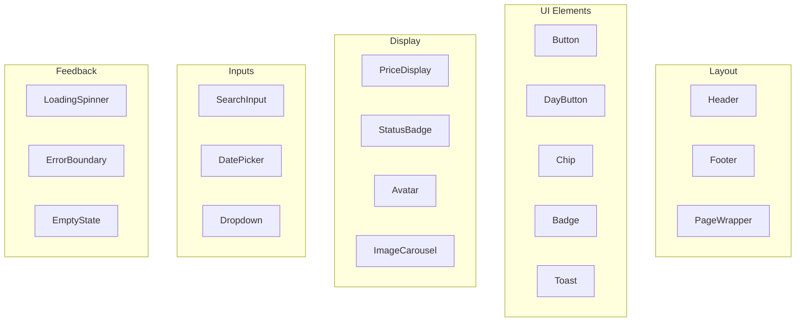

### 3. Modal Components (`islands/modals/`)

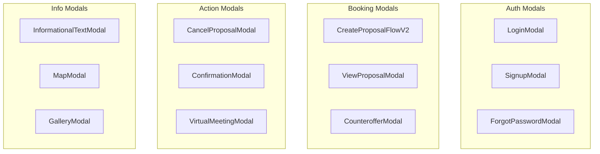

## Header Component Hierarchy

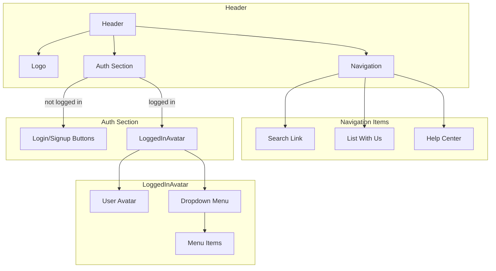

## Proposal Card Hierarchy

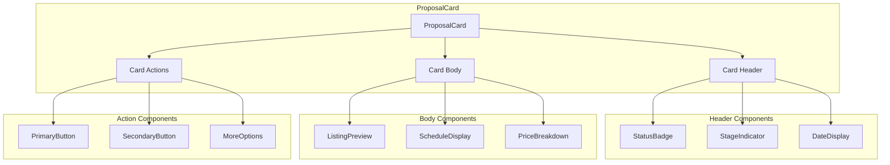

## Create Proposal Flow

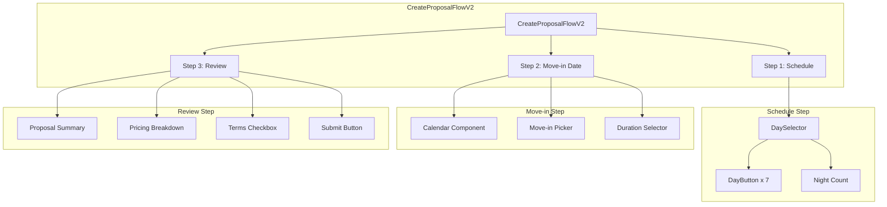

## Listing Card Component

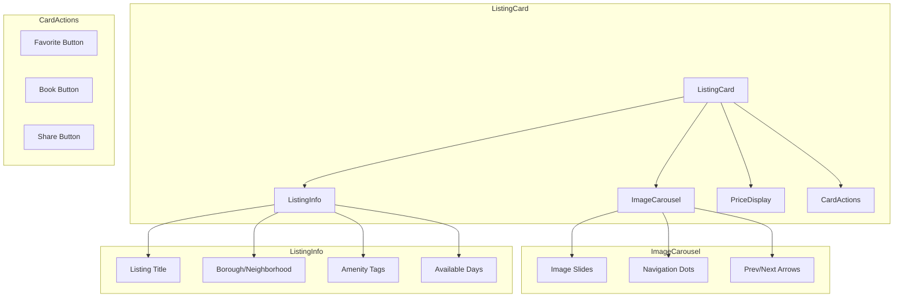

## Component Communication Patterns

### Parent to Child (Props)

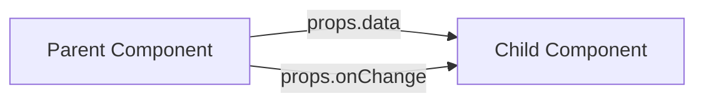

### Child to Parent (Callbacks)

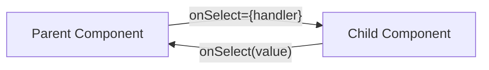

### Sibling Communication (Lift State)

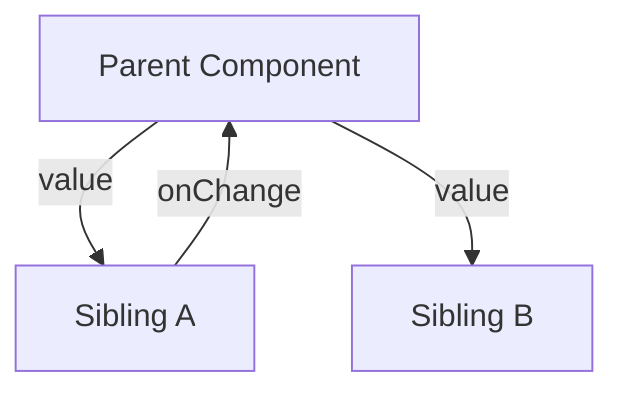

## Custom Hooks Pattern

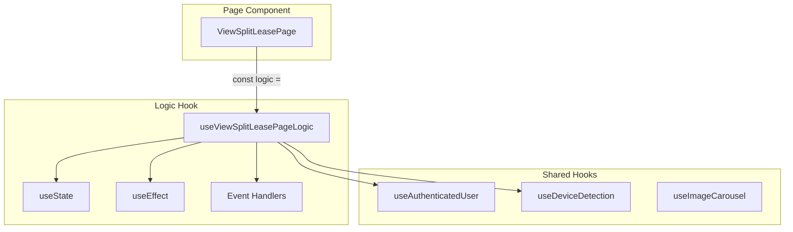

## File Organization

```
islands/
├── pages/
│   ├── HomePage/
│   │   ├── HomePage.jsx
│   │   ├── useHomePageLogic.js
│   │   └── HomePage.css
│   ├── SearchPage/
│   │   ├── SearchPage.jsx
│   │   ├── useSearchPageLogic.js
│   │   ├── components/
│   │   │   ├── SearchFilters.jsx
│   │   │   └── SearchResults.jsx
│   │   └── SearchPage.css
│   └── ...
├── shared/
│   ├── Header/
│   │   ├── Header.jsx
│   │   └── Header.css
│   ├── Button/
│   │   ├── Button.jsx
│   │   └── Button.css
│   └── ...
├── modals/
│   ├── LoginModal/
│   │   ├── LoginModal.jsx
│   │   └── LoginModal.css
│   └── ...
└── proposals/
    ├── ProposalCard.jsx
    ├── ProposalList.jsx
    └── ...
```

## Naming Conventions

| Type | Convention | Example |
|------|------------|---------|
| Page Component | PascalCase + "Page" | `SearchPage.jsx` |
| Logic Hook | "use" + ComponentName + "Logic" | `useSearchPageLogic.js` |
| Shared Component | PascalCase | `Button.jsx` |
| Modal Component | PascalCase + "Modal" | `LoginModal.jsx` |
| CSS File | Same as component | `SearchPage.css` |
| Test File | Component + ".test" | `Button.test.jsx` |
| Story File | Component + ".stories" | `Button.stories.jsx` |

## Key Design Principles

1. **Hollow Components**: Page components contain no business logic
2. **Single Responsibility**: Each component does one thing well
3. **Composition over Inheritance**: Build complex UIs from simple components
4. **Co-location**: Keep related files together (component, hook, styles)
5. **Explicit Props**: Avoid prop drilling; lift state appropriately
