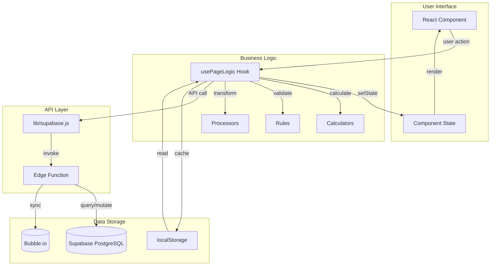
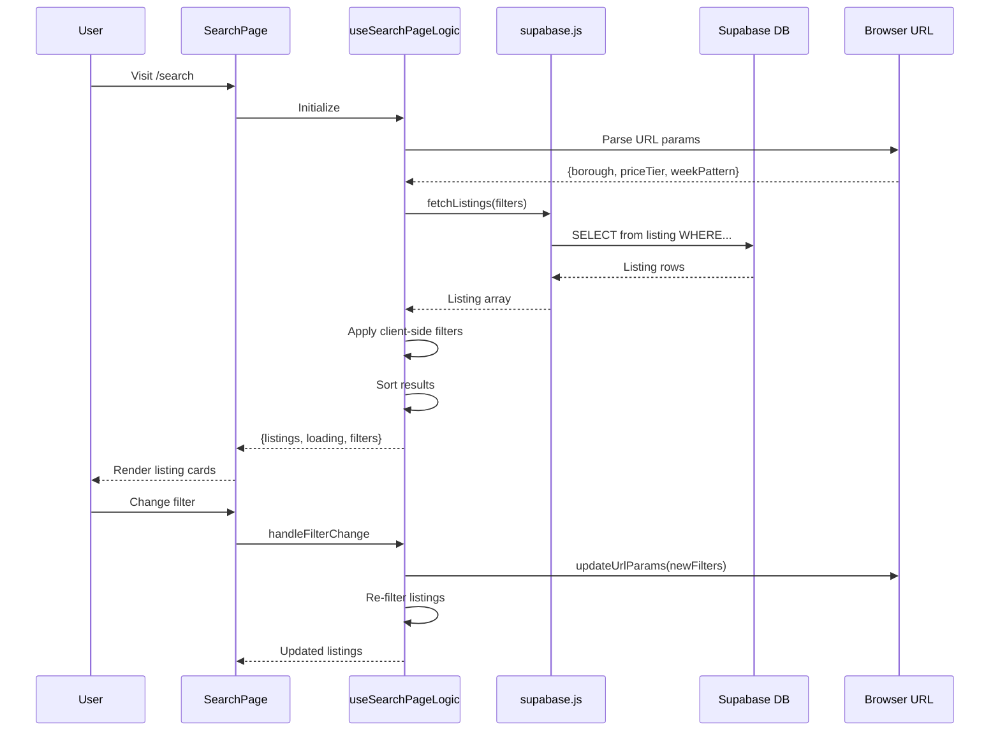
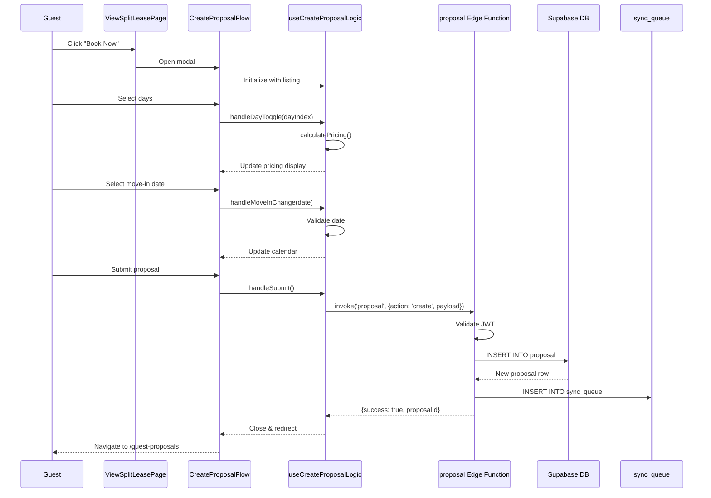
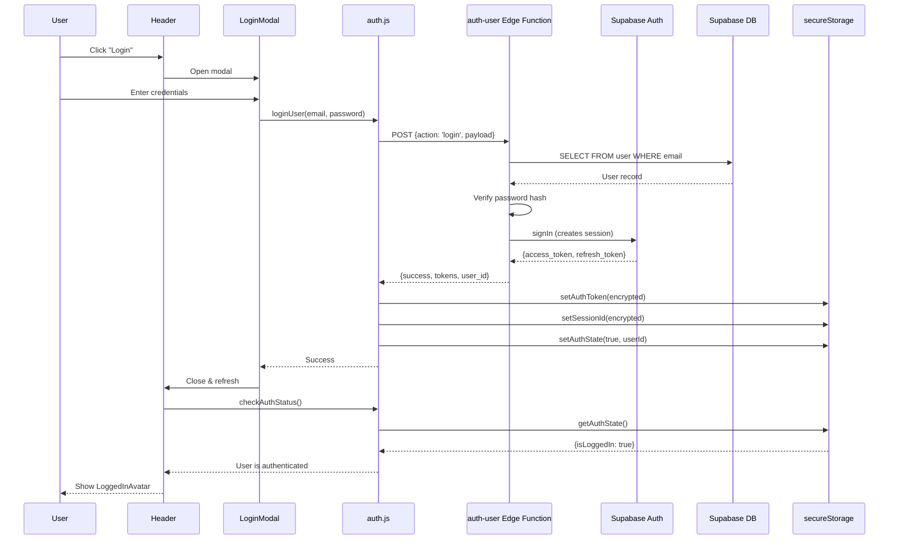
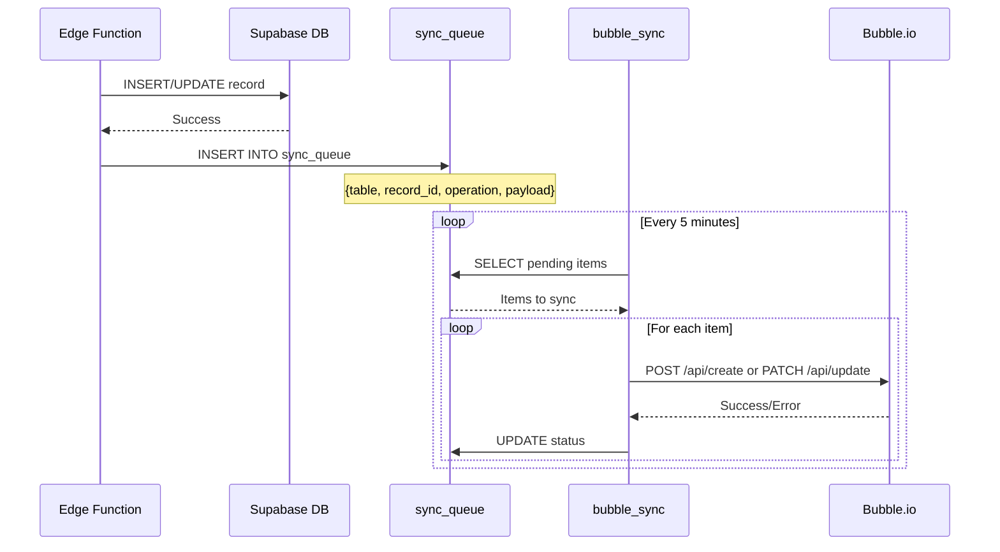
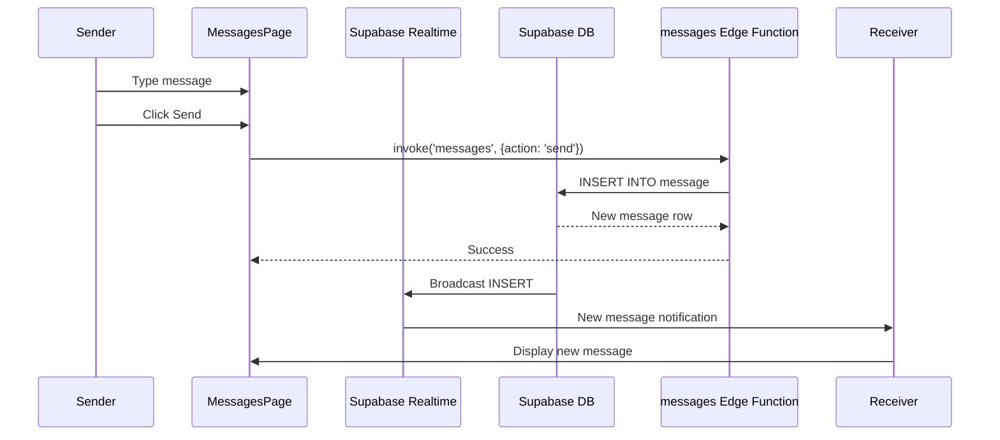
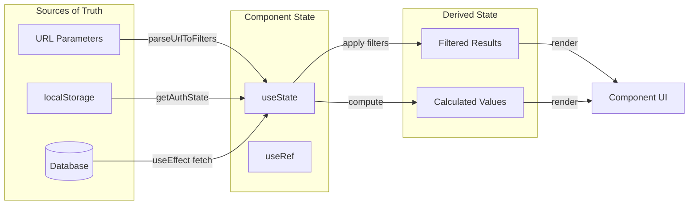
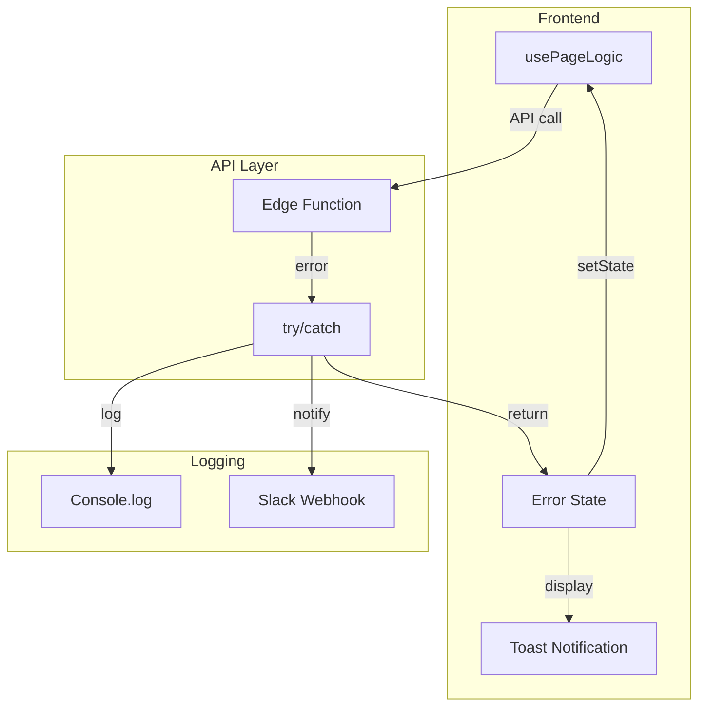

# Data Flow Architecture

This document describes how data flows through the Split Lease application.

## Core Data Flow Pattern

## Listing Search Flow

## Proposal Creation Flow

## Authentication Flow

## Database Sync Flow (Supabase to Bubble)

## Real-time Messaging Flow

## State Management Pattern

## Error Handling Flow

## Key Data Entities

| Entity | Primary Table | Sync to Bubble | Description |
|--------|---------------|----------------|-------------|
| User | `user` | Yes | User accounts (guests and hosts) |
| Listing | `listing` | Yes | Property listings |
| Proposal | `proposal` | Yes | Booking proposals |
| Lease | `lease` | Yes | Active leases |
| Message | `message` | No | In-app messaging |
| Virtual Meeting | `virtual_meeting` | Yes | Scheduled meetings |
| Rental Application | `rental_application` | No | Guest applications |
