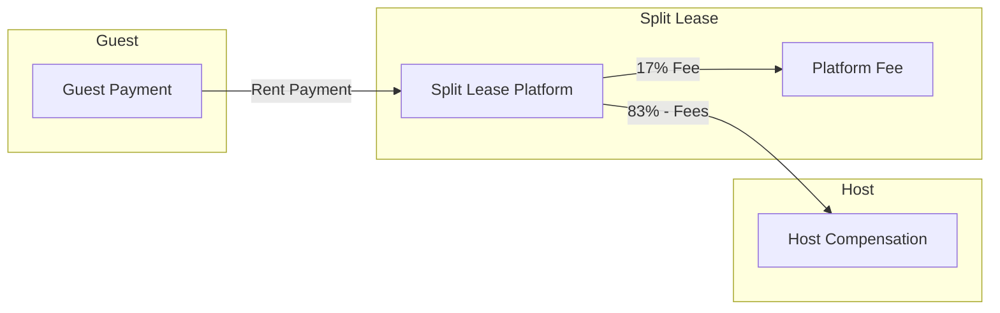
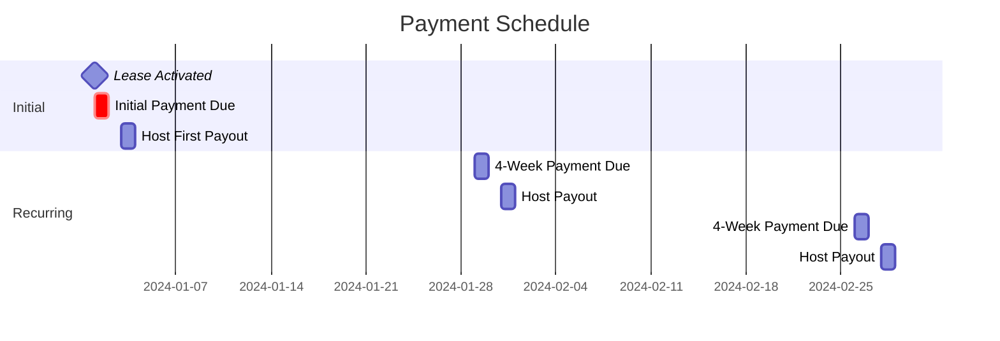
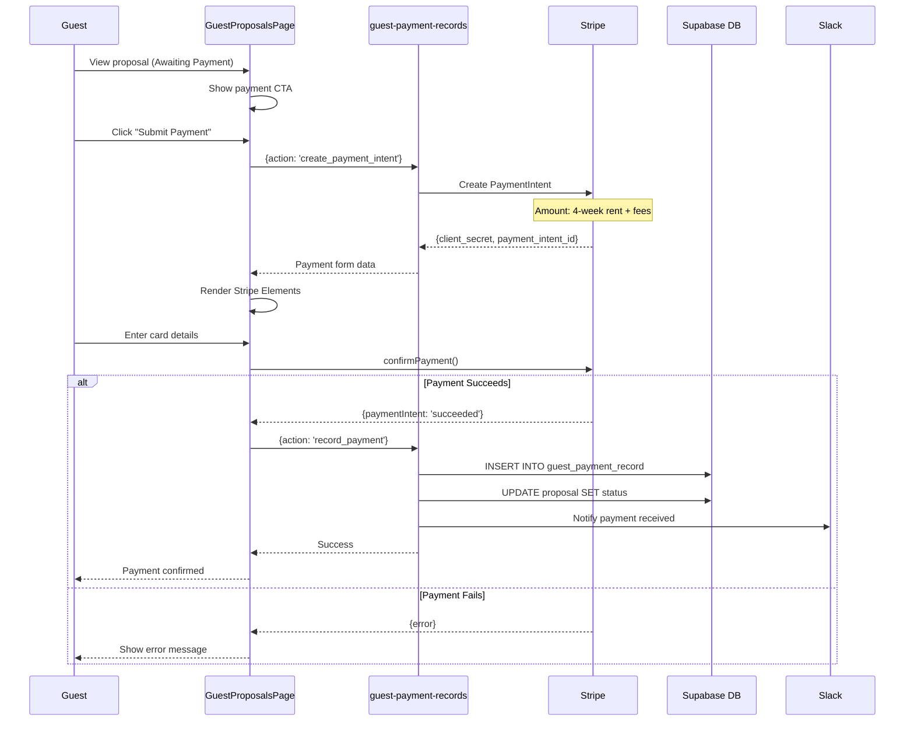
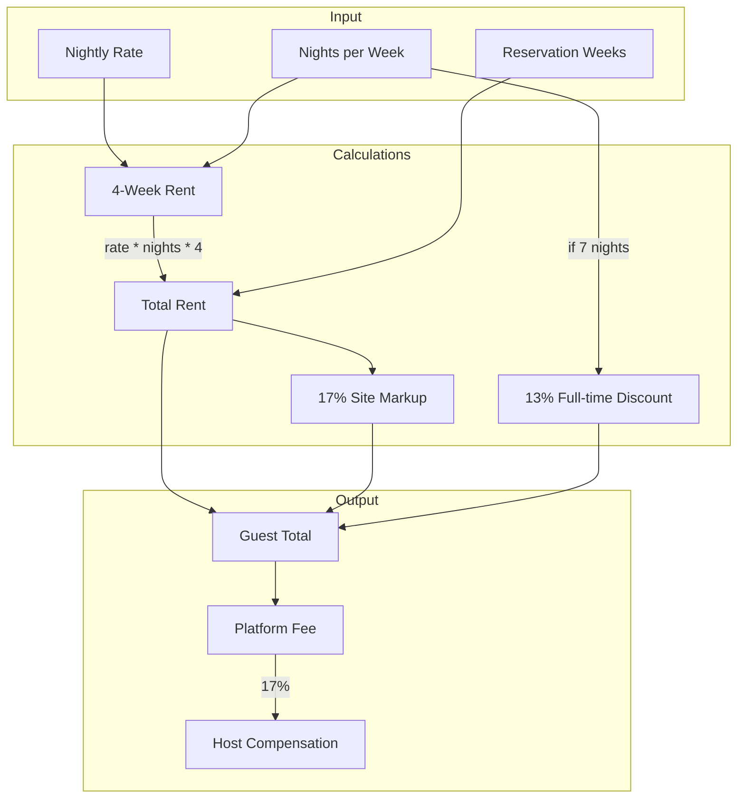
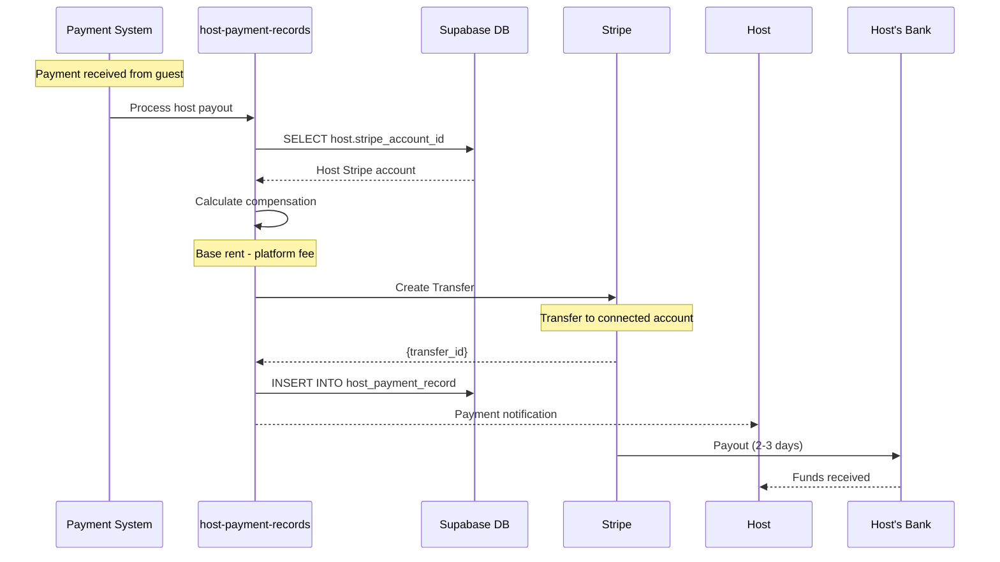
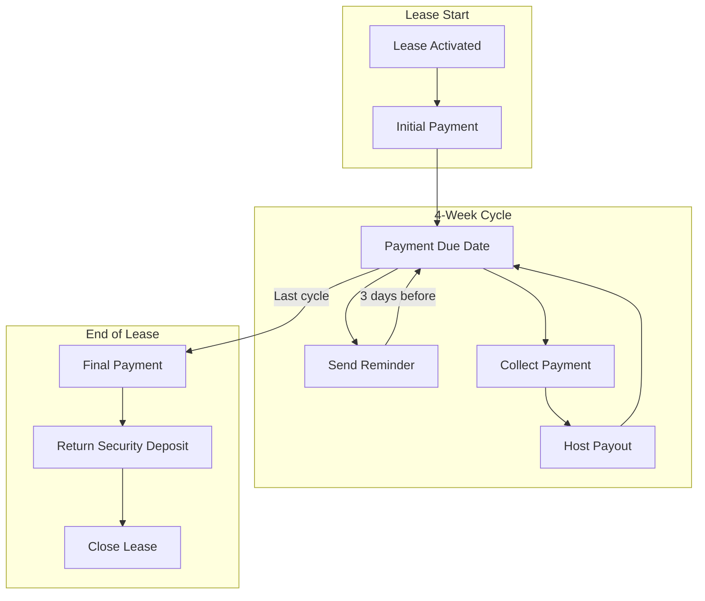
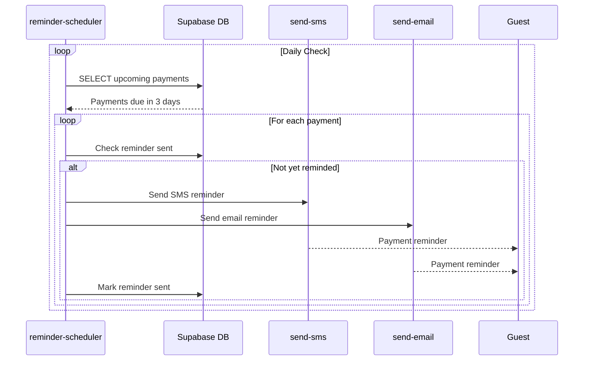
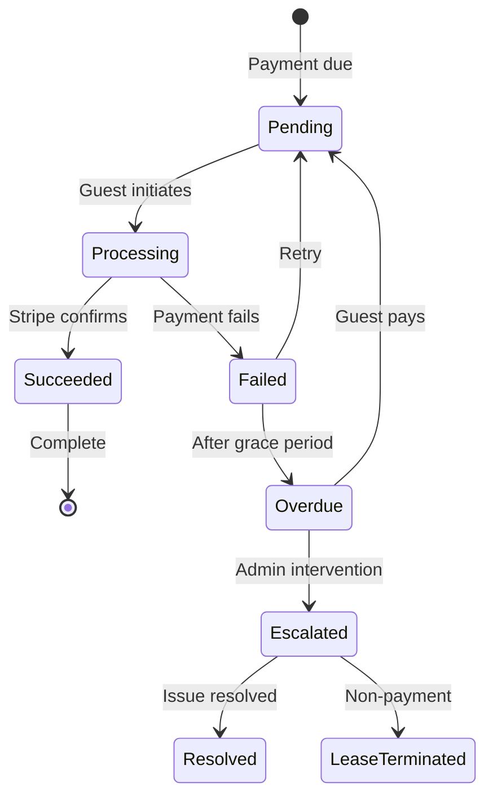
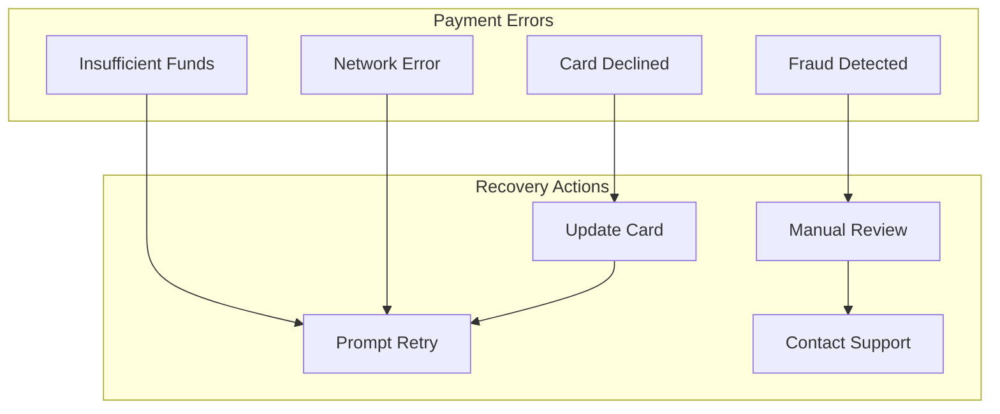

# Payment Flow Architecture

This document describes the payment system in Split Lease.

## Payment Overview

Split Lease handles two types of payments:
1. **Guest Payments** - Rent payments from guests to Split Lease
2. **Host Compensation** - Payouts from Split Lease to hosts



## Payment Timeline



## Guest Payment Flow



## Payment Breakdown Calculation



### Pricing Formula

```javascript
// 4-Week Rent = nightly rate * nights per week * 4
const fourWeekRent = nightlyRate * nightsPerWeek * 4;

// Full-time discount (7 nights only)
const discount = nightsPerWeek === 7 ? fourWeekRent * 0.13 : 0;

// Site markup
const markup = (fourWeekRent - discount) * 0.17;

// Guest total = base + markup - discount
const guestTotal = fourWeekRent + markup - discount;

// Host compensation = base - discount (no markup)
const hostCompensation = fourWeekRent - discount;
```

## Host Compensation Flow



## Recurring Payment Schedule



## Payment Reminder System



## Payment States



## Fee Structure

| Component | Rate | Description |
|-----------|------|-------------|
| Base Rent | - | Nightly rate x nights x weeks |
| Site Markup | 17% | Added to guest total |
| Full-time Discount | 13% | Applied for 7-night stays |
| Cleaning Fee | Variable | One-time, set by host |
| Damage Deposit | Variable | Refundable, set by host |

## Payment Edge Functions

| Function | Purpose |
|----------|---------|
| `guest-payment-records` | Process guest payments |
| `host-payment-records` | Process host payouts |
| `pricing` | Calculate pricing breakdowns |
| `pricing-admin` | Admin pricing tools |

## Security Considerations

1. **PCI Compliance**: Card details never touch our servers (Stripe Elements)
2. **Webhook Verification**: Stripe webhooks verified with signing secret
3. **Idempotency**: Payment operations are idempotent
4. **Audit Trail**: All payments logged with timestamps
5. **Escrow**: Platform holds funds before host payout

## Error Handling



## Key Files

| File | Purpose |
|------|---------|
| `logic/calculators/pricing/` | Pricing calculations |
| `supabase/functions/guest-payment-records/` | Guest payments |
| `supabase/functions/host-payment-records/` | Host payouts |
| `supabase/functions/pricing/` | Pricing API |
