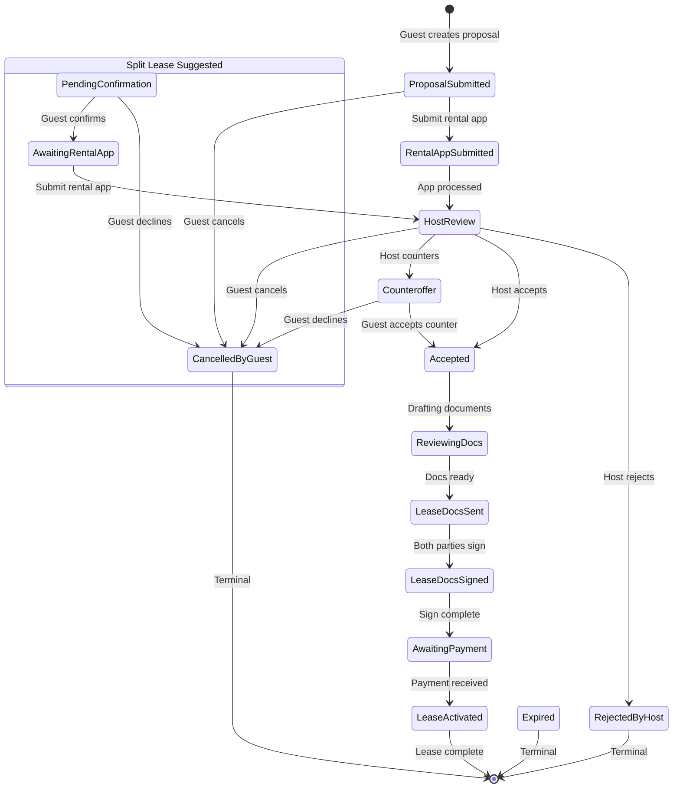
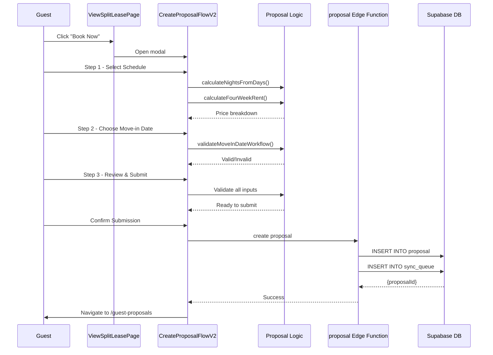
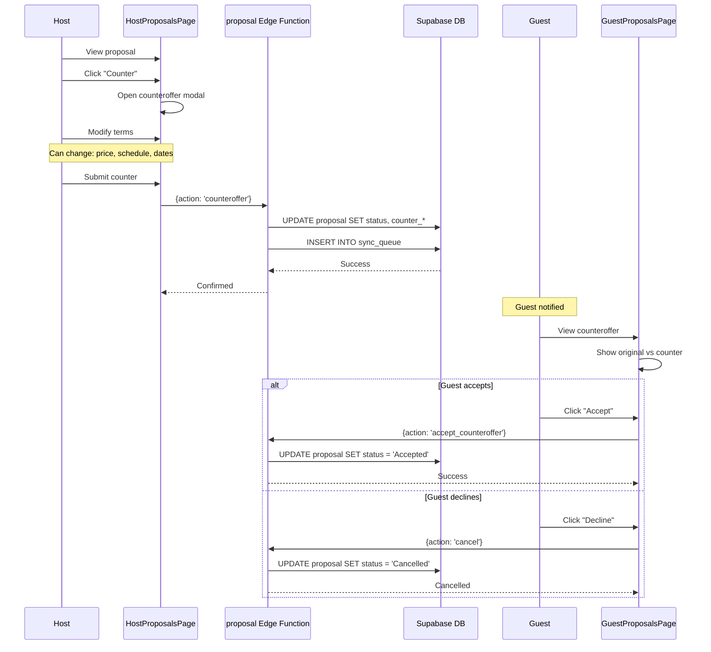
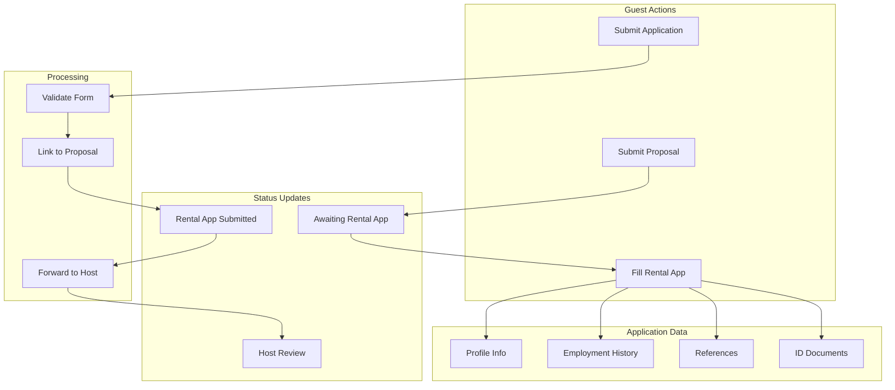
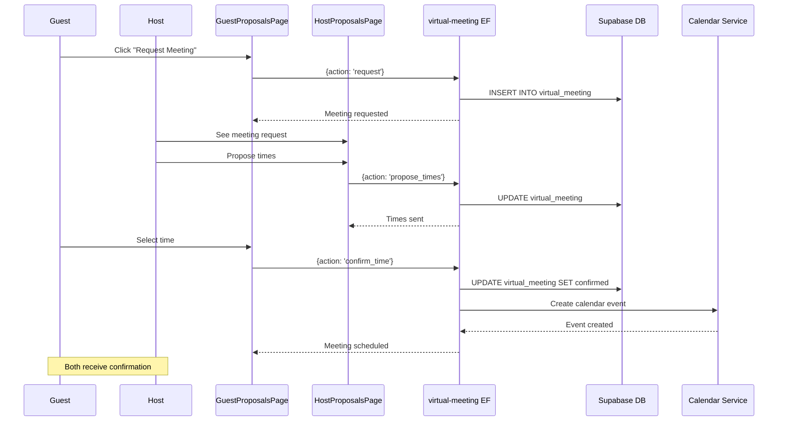
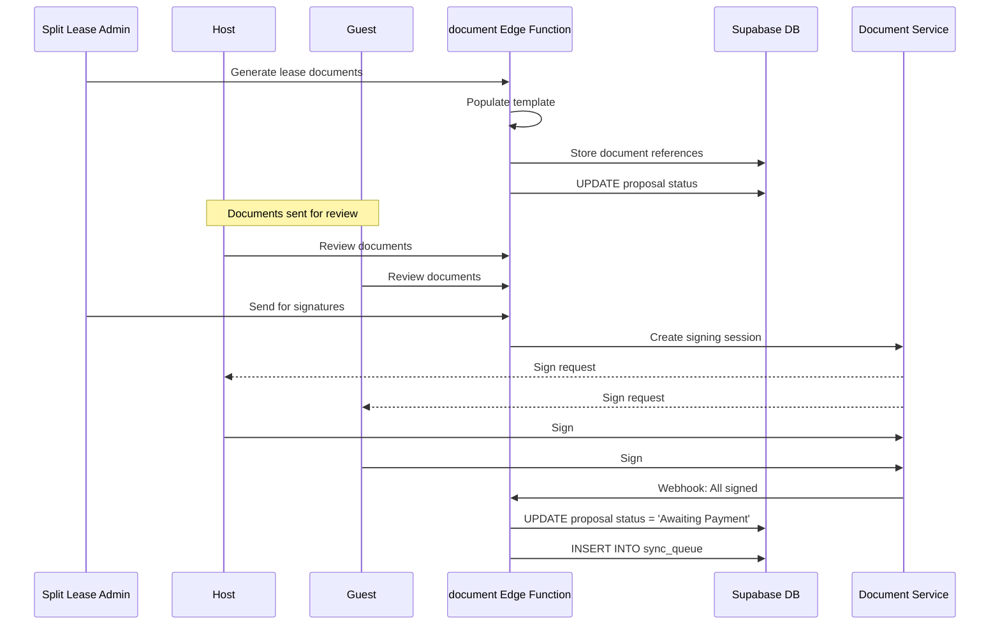
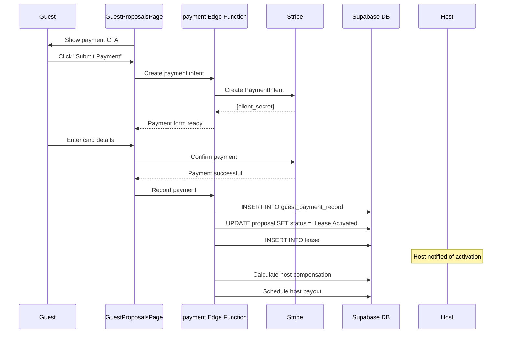
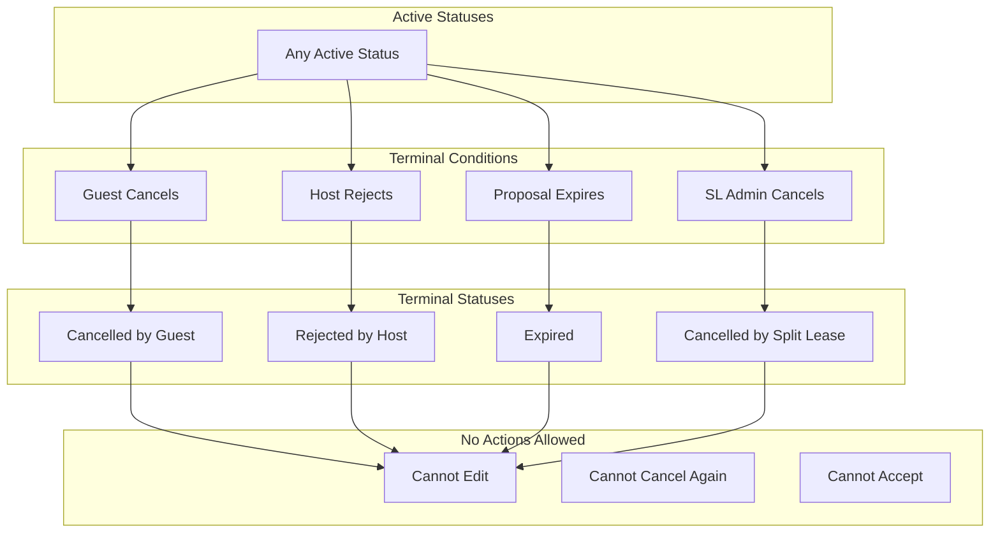

# Proposal Lifecycle Architecture

This document describes the complete lifecycle of a proposal in Split Lease.

## Proposal Status Overview

Split Lease proposals go through multiple stages from creation to lease activation.



## Status Configuration

Each status has specific properties and available actions:

| Status | Stage | Usual Order | Available Actions |
|--------|-------|-------------|-------------------|
| Proposal Submitted - Awaiting Rental App | 1 | 0 | submit_rental_app, cancel, request_vm, message |
| SL Suggested - Pending Confirmation | 1 | 0 | confirm, submit_rental_app, cancel |
| SL Suggested - Awaiting Rental App | 1 | 0 | submit_rental_app, cancel |
| Rental Application Submitted | 2 | 1 | request_vm, cancel, message |
| Host Review | 3 | 1 | request_vm, cancel, message |
| Counteroffer Submitted | 3 | 2 | accept, decline, request_vm, message |
| Accepted - Drafting Lease | 4 | 3 | request_vm, message |
| Reviewing Documents | 4 | 3 | review_documents, request_vm |
| Lease Documents Sent for Review | 4 | 4 | review_documents, request_vm |
| Lease Documents Sent for Signatures | 5 | 5 | sign_documents, request_vm |
| Awaiting Initial Payment | 6 | 6 | submit_payment, request_vm |
| Lease Activated | 6 | 7 | view_lease, view_house_manual |
| Cancelled by Guest | - | 99 | view_listing, explore_rentals |
| Rejected by Host | - | 99 | view_listing, explore_rentals |
| Expired | - | 99 | view_listing, explore_rentals |

## Proposal Creation Flow



## Counteroffer Flow



## Rental Application Flow



## Virtual Meeting Integration



## Document Signing Flow



## Payment Flow



## Terminal Status Rules



## Proposal Rules Functions

Key business rule functions in `logic/rules/proposals/`:

| Function | Purpose |
|----------|---------|
| `canCancelProposal()` | Check if guest can cancel |
| `canAcceptProposal()` | Check if counteroffer can be accepted |
| `canModifyProposal()` | Check if proposal can be edited |
| `canSubmitRentalApplication()` | Check if rental app is needed |
| `canRequestVirtualMeeting()` | Check if VM can be requested |
| `isProposalActive()` | Check if proposal is in active flow |
| `isLeaseActivated()` | Check if lease is complete |
| `needsRentalApplicationSubmission()` | Check if rental app missing |
| `canConfirmSuggestedProposal()` | Check if SL suggestion can be confirmed |

## Status Transition Matrix

```
From Status                              | Valid Next Statuses
-----------------------------------------|--------------------
Proposal Submitted - Awaiting Rental App | Rental App Submitted, Cancelled
SL Suggested - Pending Confirmation      | SL Suggested - Awaiting App, Cancelled
SL Suggested - Awaiting Rental App       | Host Review, Cancelled
Rental App Submitted                     | Host Review, Cancelled
Host Review                              | Counteroffer, Accepted, Rejected, Cancelled
Counteroffer Submitted                   | Accepted, Cancelled
Accepted - Drafting                      | Reviewing Documents, Cancelled
Reviewing Documents                      | Lease Docs Sent, Cancelled
Lease Docs Sent for Review               | Lease Docs for Signatures, Cancelled
Lease Docs Sent for Signatures           | Awaiting Payment, Cancelled
Awaiting Initial Payment                 | Lease Activated, Cancelled
Lease Activated                          | (Terminal - no transitions)
Cancelled/Rejected/Expired               | (Terminal - no transitions)
```

## Key Files

| File | Purpose |
|------|---------|
| `logic/constants/proposalStatuses.js` | Status configuration |
| `logic/rules/proposals/proposalRules.js` | Proposal business rules |
| `logic/rules/proposals/canAcceptProposal.js` | Accept rule |
| `logic/rules/proposals/canCancelProposal.js` | Cancel rule |
| `supabase/functions/proposal/` | Proposal Edge Function |
