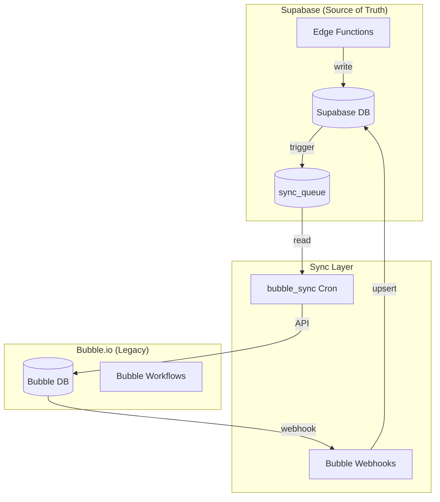
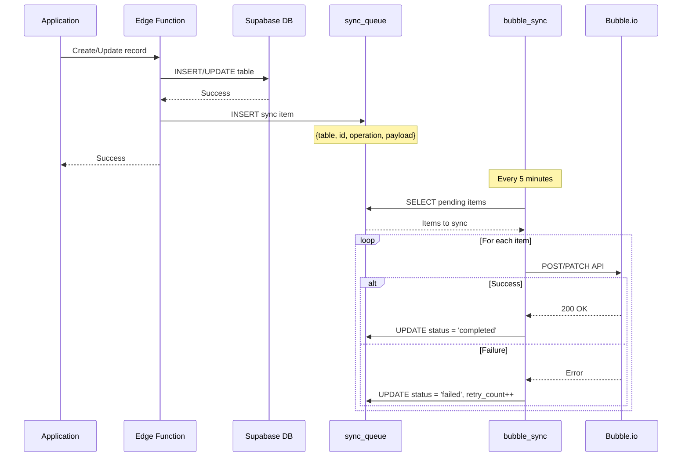
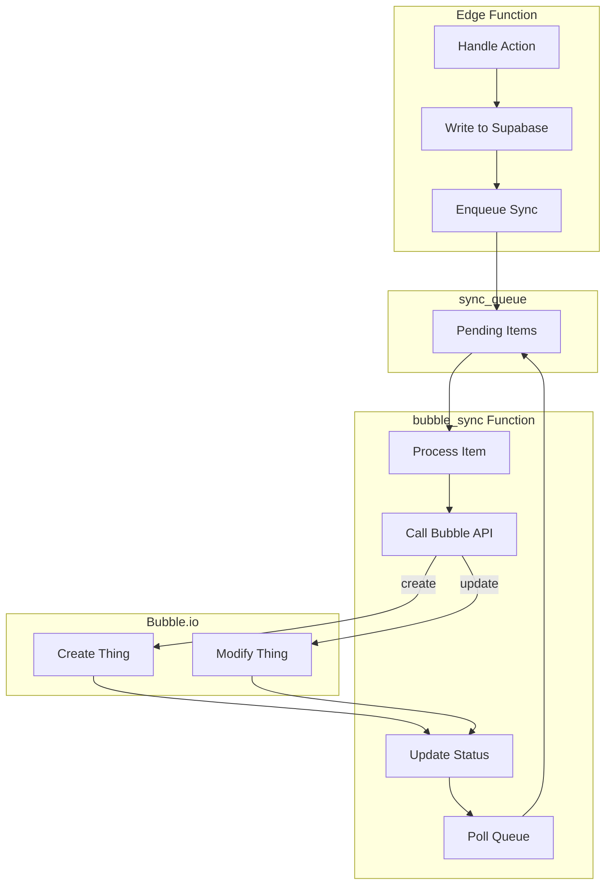
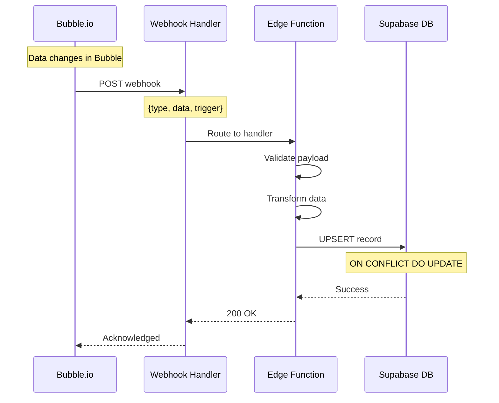
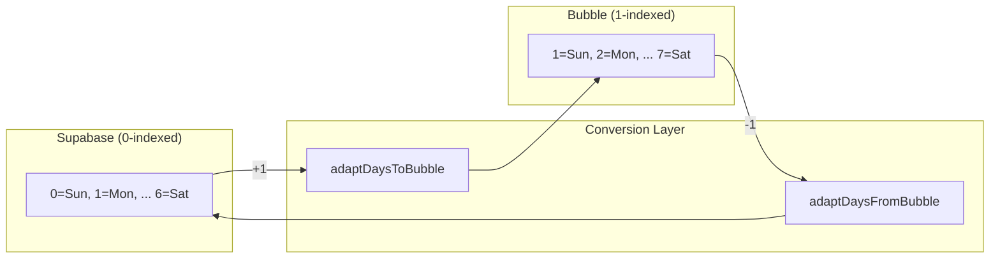
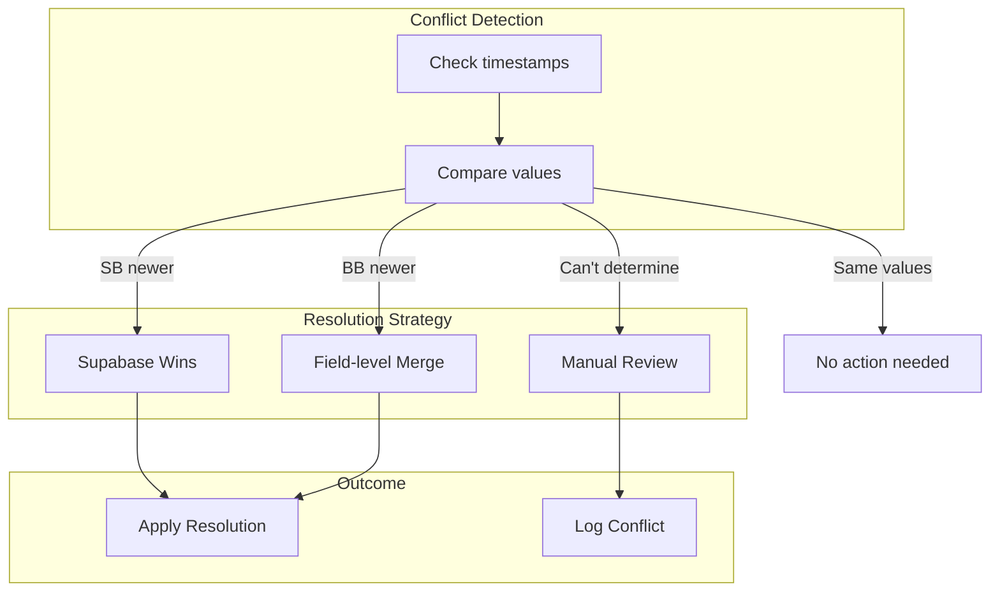
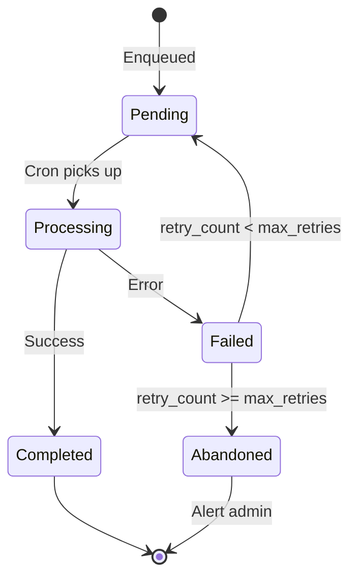
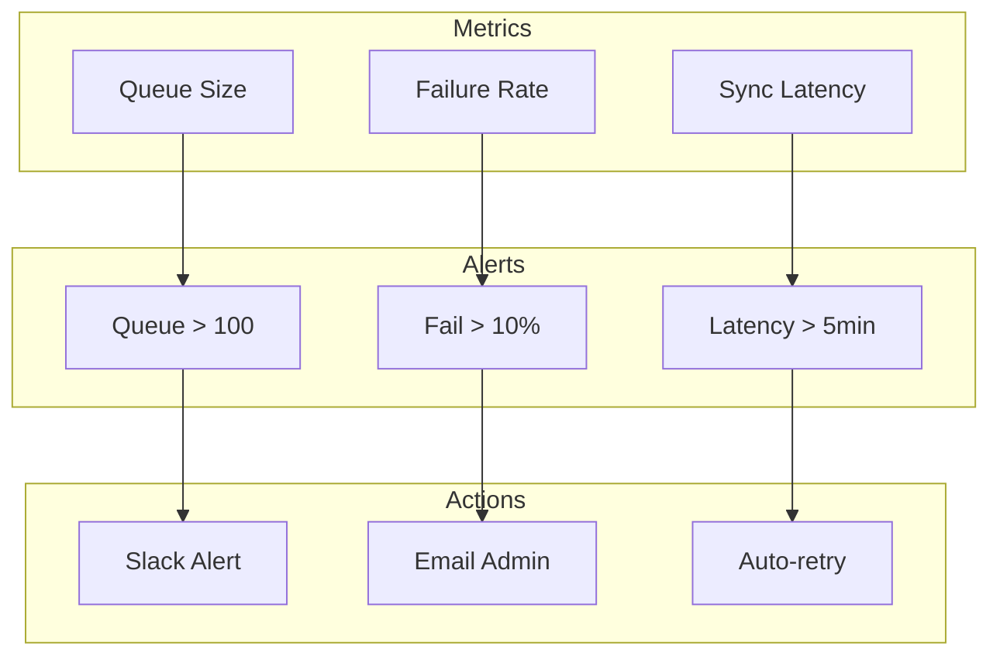
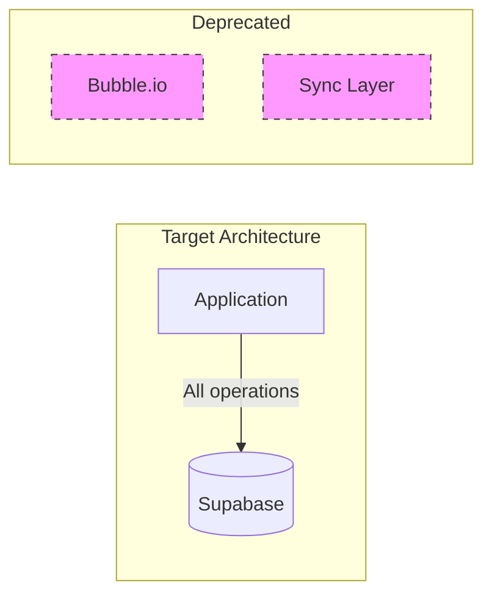

# Sync Architecture

This document describes the bidirectional data synchronization between Supabase and Bubble.io.

## Sync Overview

Split Lease is migrating from Bubble.io to Supabase. During the transition, data must stay synchronized between both systems.



## Sync Queue Pattern



## Sync Queue Schema

```sql
CREATE TABLE sync_queue (
    id UUID PRIMARY KEY DEFAULT gen_random_uuid(),
    table_name TEXT NOT NULL,
    record_id TEXT NOT NULL,
    operation TEXT NOT NULL,  -- 'create', 'update', 'delete'
    payload JSONB,
    status TEXT DEFAULT 'pending',
    retry_count INT DEFAULT 0,
    max_retries INT DEFAULT 3,
    error_message TEXT,
    created_at TIMESTAMPTZ DEFAULT now(),
    processed_at TIMESTAMPTZ,
    CONSTRAINT valid_operation CHECK (operation IN ('create', 'update', 'delete')),
    CONSTRAINT valid_status CHECK (status IN ('pending', 'processing', 'completed', 'failed'))
);
```

## Tables Synchronized

| Supabase Table | Bubble Thing | Sync Direction |
|----------------|--------------|----------------|
| `user` | User | Bidirectional |
| `listing` | Listing | Bidirectional |
| `proposal` | Proposal | Bidirectional |
| `lease` | Lease | Bidirectional |
| `virtual_meeting` | Virtual Meeting | Bidirectional |
| `account_host` | Account Host | Supabase to Bubble |
| `account_guest` | Account Guest | Supabase to Bubble |

## Supabase to Bubble Sync



## Bubble to Supabase Sync



## Day Index Conversion

All day indices must be converted at sync boundaries:



```javascript
// Supabase to Bubble
export function adaptDaysToBubble({ jsDays }) {
  return jsDays.map(day => day + 1);
}

// Bubble to Supabase
export function adaptDaysFromBubble({ bubbleDays }) {
  return bubbleDays.map(day => day - 1);
}
```

## Conflict Resolution



## Retry Logic



## Sync Monitoring



## Key Sync Functions

| Function | File | Purpose |
|----------|------|---------|
| `enqueueSyncItem` | `_shared/sync.ts` | Add item to sync queue |
| `bubble_sync` | `bubble_sync/index.ts` | Process sync queue |
| `adaptDaysToBubble` | `processors/external/` | Day conversion |
| `adaptDaysFromBubble` | `processors/external/` | Day conversion |

## Edge Function Sync Pattern

```typescript
// Example: Creating a listing
async function handleCreateListing(payload, supabaseAdmin) {
  // 1. Generate ID
  const { data: newId } = await supabaseAdmin.rpc('generate_bubble_id');

  // 2. Insert into Supabase
  const { data, error } = await supabaseAdmin
    .from('listing')
    .insert({ _id: newId, ...payload })
    .select()
    .single();

  if (error) throw error;

  // 3. Enqueue sync to Bubble
  await enqueueSyncItem(supabaseAdmin, {
    table_name: 'listing',
    record_id: newId,
    operation: 'create',
    payload: adaptToBubbleFormat(data)
  });

  return data;
}
```

## Migration Status

| Entity | Supabase | Bubble | Sync Status |
|--------|----------|--------|-------------|
| Users | Primary | Secondary | Bidirectional |
| Listings | Primary | Secondary | Bidirectional |
| Proposals | Primary | Secondary | Bidirectional |
| Messages | Primary | None | Supabase only |
| Rental Apps | Primary | None | Supabase only |

## Future State (Post-Migration)



Once migration is complete:
1. Disable sync queue processing
2. Remove Bubble webhook handlers
3. Archive Bubble data
4. Remove sync-related code
