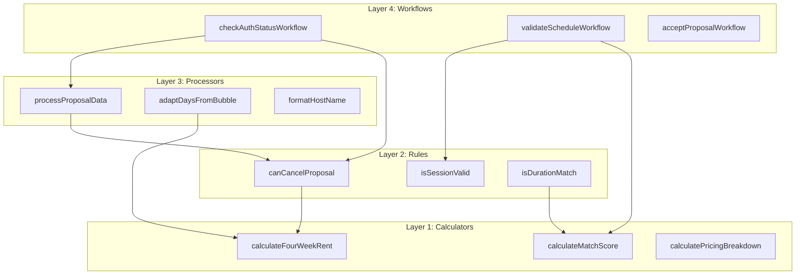
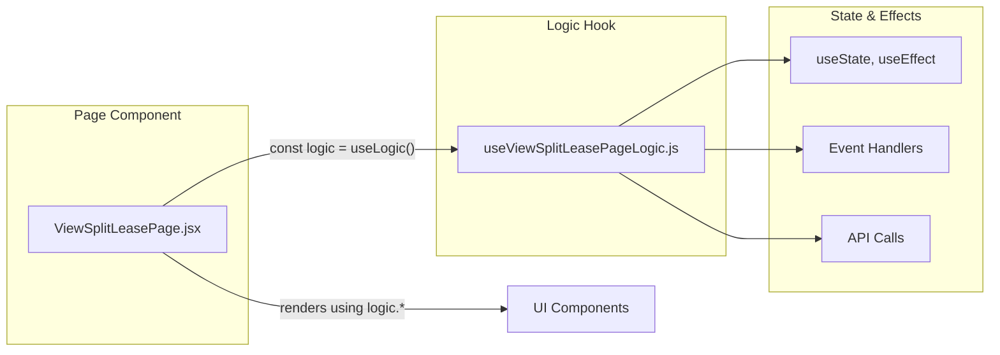
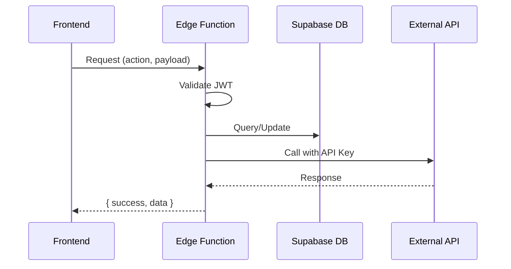

# System Architecture Overview

This document provides a high-level overview of the Split Lease application architecture.

## High-Level System Architecture

```mermaid
graph TB
    subgraph "Frontend (Cloudflare Pages)"
        subgraph "React 18 Islands"
            HP[HomePage]
            SP[SearchPage]
            VSL[ViewSplitLeasePage]
            GP[GuestProposalsPage]
            HPP[HostProposalsPage]
            AP[AccountProfilePage]
            SL[SelfListingPage]
            LD[ListingDashboardPage]
            HO[HostOverviewPage]
        end

        subgraph "Shared Components"
            Header[Header + LoggedInAvatar]
            Footer[Footer]
            Modals[Modal Components]
            Maps[Google Maps Integration]
        end

        subgraph "Business Logic (4-Layer)"
            Calc[Calculators]
            Rules[Rules]
            Proc[Processors]
            WF[Workflows]
        end

        subgraph "Libraries"
            Auth[auth.js]
            SB[supabase.js]
            Nav[navigation.js]
            URL[urlParams.js]
        end
    end

    subgraph "Backend (Supabase)"
        subgraph "Edge Functions (Deno)"
            AuthUser[auth-user]
            Proposal[proposal]
            Listing[listing]
            AIGateway[ai-gateway]
            Messages[messages]
            Payment[payment-records]
            VM[virtual-meeting]
            Sync[bubble_sync]
        end

        subgraph "Database (PostgreSQL)"
            Users[(user)]
            Listings[(listing)]
            Proposals[(proposal)]
            Leases[(lease)]
            SyncQueue[(sync_queue)]
            RefTables[(reference_table)]
        end

        subgraph "Auth"
            SupaAuth[Supabase Auth]
            OAuth[OAuth Providers]
        end
    end

    subgraph "External Services"
        Bubble[Bubble.io - Legacy]
        OpenAI[OpenAI API]
        Stripe[Stripe Payments]
        Twilio[Twilio SMS]
        Resend[Resend Email]
        Slack[Slack Webhooks]
        GCP[Google Cloud - Maps]
    end

    HP --> Header
    SP --> Header
    VSL --> Header

    Auth --> AuthUser
    SB --> AuthUser
    SB --> Proposal
    SB --> Listing

    AuthUser --> Users
    Proposal --> Proposals
    Listing --> Listings

    AuthUser --> SupaAuth
    SupaAuth --> OAuth

    AIGateway --> OpenAI
    Sync --> Bubble
    Messages --> Twilio
    Messages --> Resend
```



## Key Architecture Principles

### 1. Islands Architecture
Each page is an independent React root that mounts to its own HTML file. There is no client-side routing - navigation between pages causes full page loads. This simplifies state management and enables independent deployment of page bundles.

### 2. Four-Layer Logic Architecture
Business logic is separated into four layers with strict dependency rules:



**Dependency Rules:**
- Calculators: Pure functions with no dependencies
- Rules: May call calculators
- Processors: May call calculators and rules
- Workflows: Orchestrate all layers

### 3. Hollow Component Pattern
Page components contain NO business logic - they delegate everything to custom hooks:



### 4. Edge Function Proxy Pattern
All external API calls (Bubble, OpenAI, Stripe, etc.) are proxied through Supabase Edge Functions. API keys are stored server-side in Supabase Secrets.



## Technology Stack

| Layer | Technology | Purpose |
|-------|------------|---------|
| Frontend | React 18 + Vite | UI framework and build tool |
| Styling | CSS Variables + styled-components | Theming and component styles |
| State | React useState/useEffect | Local component state |
| Backend | Supabase Edge Functions (Deno) | API endpoints |
| Database | PostgreSQL (Supabase) | Primary data store |
| Auth | Supabase Auth | User authentication |
| Hosting | Cloudflare Pages | Frontend deployment |
| Legacy | Bubble.io | Bidirectional sync (migrating away) |

## Directory Structure

```
Split Lease/
├── app/                      # Frontend application
│   ├── public/               # Static HTML entry points
│   ├── src/
│   │   ├── islands/          # React components
│   │   │   ├── pages/        # Page components
│   │   │   ├── shared/       # Shared components
│   │   │   └── modals/       # Modal components
│   │   ├── logic/            # Four-layer business logic
│   │   │   ├── calculators/  # Pure calculation functions
│   │   │   ├── rules/        # Boolean predicates
│   │   │   ├── processors/   # Data transformers
│   │   │   └── workflows/    # Orchestration
│   │   ├── lib/              # Utilities and API clients
│   │   ├── hooks/            # Custom React hooks
│   │   └── styles/           # CSS files
│   └── vite.config.js        # Build configuration
├── supabase/
│   ├── functions/            # Edge Functions (Deno/TypeScript)
│   └── migrations/           # Database migrations
└── docs/                     # Documentation
```

## Security Model

1. **Frontend**: No API keys exposed, all sensitive operations via Edge Functions
2. **Edge Functions**: JWT validation, API key access via Supabase Secrets
3. **Database**: Row-Level Security (RLS) policies on all tables
4. **Auth**: Supabase Auth with OAuth (Google, LinkedIn) and email/password
5. **Storage**: Encrypted localStorage for session tokens (AES encryption)
