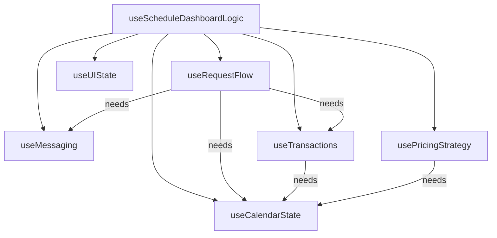

# Specification: ScheduleDashboard Refactoring

## 1. Problem Statement
The `useScheduleDashboardLogic.js` hook has grown to **1654 lines (55KB)**, making it difficult to:
- Navigate and understand
- Test individual domains independently
- Iterate on specific features without risk of regression
- Onboard new developers

**Comparison**: `useGuestLeasesPageLogic.js` is **670 lines (20KB)** and is already approaching the upper limit of readability.

## 2. Proposed Architecture

### 2.1 Domain Decomposition
Split the monolithic hook into **6 domain-specific hooks**:

| Hook | Responsibility | ~Lines |
|------|----------------|--------|
| `useCalendarState` | userNights, roommateNights, pendingNights, blockedNights, sharedNights, currentMonth, adjacency detection | 150 |
| `useRequestFlow` | selectedNight, requestType, isSwapMode, isCounterMode, all request/swap/share handlers | 400 |
| `useMessaging` | messages, isSending, handleSendMessage | 80 |
| `useTransactions` | transactions, transactionsByDate, handleAccept/Decline/Cancel | 250 |
| `usePricingStrategy` | pricingStrategy, priceOverlays, computedExamples, localStorage persistence | 200 |
| `useUIState` | isBuyOutOpen, isChatOpen, dashboardMode, modals, activeTransactionId | 80 |

**Main Hook**: `useScheduleDashboardLogic` becomes a **thin orchestrator** (~100 lines) that:
1. Calls each domain hook
2. Passes cross-domain dependencies
3. Returns unified API to component

### 2.2 Directory Structure
```
ScheduleDashboard/
├── index.jsx                      # Main component (unchanged)
├── useScheduleDashboardLogic.js   # Thin orchestrator
├── hooks/
│   ├── useCalendarState.js
│   ├── useRequestFlow.js
│   ├── useMessaging.js
│   ├── useTransactions.js
│   ├── usePricingStrategy.js
│   └── useUIState.js
├── helpers/
│   ├── dateHelpers.js             # toDateString, toDateStrings, etc.
│   └── priceCalculations.js       # getNoticeThresholdForDate, EDGE_MULTIPLIERS
├── data/
│   └── mockData.js                # MOCK_LEASE, MOCK_MESSAGES, etc.
├── api/
│   └── scheduleDashboardApi.js    # fetchUserNights, createBuyoutRequest, etc.
└── components/
    └── (existing components)
```

### 2.3 Cross-Domain Dependencies



## 3. Implementation Plan

### Phase 1: Extract Helpers & Data (Low Risk)
1. Create `helpers/dateHelpers.js` - extract `toDateString`, `toDateStrings`
2. Create `helpers/priceCalculations.js` - extract pricing constants
3. Create `data/mockData.js` - extract all MOCK_* constants
4. Create `api/scheduleDashboardApi.js` - extract fetch stubs

### Phase 2: Extract UI State Hook (Low Risk)
1. Create `hooks/useUIState.js`
2. Move drawer states, modal states, dashboardMode
3. Update main hook to use `useUIState()`

### Phase 3: Extract Messaging Hook (Medium Risk)
1. Create `hooks/useMessaging.js`
2. Move messages state and `handleSendMessage`
3. Accept `setMessages` callback for cross-domain updates

### Phase 4: Extract Transactions Hook (Medium Risk)
1. Create `hooks/useTransactions.js`
2. Move transactions state, transactionsByDate, handlers
3. Accept callbacks for calendar state updates

### Phase 5: Extract Pricing Hook (Medium Risk)
1. Create `hooks/usePricingStrategy.js`
2. Move pricing state, overlays, computed examples
3. Accept userNights as dependency

### Phase 6: Extract Calendar & Request Hooks (High Risk)
1. Create `hooks/useCalendarState.js`
2. Create `hooks/useRequestFlow.js`
3. These are most intertwined - do together
4. Extensive testing required

## 4. Acceptance Criteria
- [ ] No functional regression (all existing features work)
- [ ] Each hook is < 300 lines
- [ ] Main orchestrator is < 150 lines
- [ ] Unit tests can target individual hooks
- [ ] IDE navigation is improved (smaller files)

## 5. Testing Strategy
- Run existing E2E tests after each phase
- Add unit tests for each new hook
- Manual verification of all request flows
